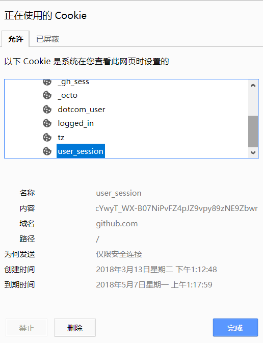

1.预估到了大客户的到来，前阵子脚本需要更新VIP录入机制了，因为用的是时间戳取部分特定格式MD5转码后取前几位本地判断。
弊端：容易在一段时间内反复激活软件
改进A:加入设备ID,MAC地址，IP限制判断。
改进B:高端GPS和网络定位一定时间地区只允许激活一个设备
改进C:引入手机登录验证，但是费时间
后两者都已经脱离本地范畴了，本地设备易克隆，技术缺陷于是还是引入网络验证吧！

2.简单一点，version对比验证
服务端 前台管理员可以微信扫码生成一个有效期一小时内的激活码，用后就销毁，本地写配置项，accepted!
具体：管理员扫码添加（CDKEY->MD5）到哈希表->用户输入CDKEY，POST请求返回MD5，本地验证MD5在有效期内，写配置项accepted。

3.激活软件验证解决，但是激活后使用系统克隆，也是没辙的，本地一个配置项被克隆了，也等于激活了，所以每次启动都得网络认证一遍，
结论：对于安卓脚本辅助，不能依靠本地验证，以及首次激活认证！！

4.重点就来了，验证要引入secret，而一个secret同时只有一个设备使用，这不是很像Session吗?于是温习一遍Session：

 session 会话，是为了解决HTTP协议无状态（stateless），由于Basic auth单点认证频繁提交用户名密码敏感数据，存在潜在不安全因素，使用sessionID作为代替用户名密码
 的通行证，举个例子，指纹支付代替输入支付密码。
 
我们来看看cookie有什么？

######     *PSTM=1522651151; BIDUPSID=6F3CC1428D304FE6AB8F663439DC87F5; BD_UPN=12314753; BAIDUID=9F7D8F405FD61923008A26B4D92CE61C:FG=1; ispeed_lsm=0; BDORZ=B490B5EBF6F3CD402E515D22BCDA1598; H_PS_PSSID=1440_25809_21102_20929; BDSFRCVID=5iLsJeCCxG3AKevAdU18XBZtZTrx3jp4oJiP3J; H_BDCLCKID_SF=JbADoDD-JCvbfP0kKtr_MJQH-UnLq5Q0BT7Z0lOnMp05EqvN5xQf3jobW-5z-pTn-j-eBtt2ahcEVKO_e4bK-TrLjGDjtf5;sugstore=1; BD_CK_SAM=1; PSINO=2; H_PS_645EC=45c0fdLyJ6PyWksA6NqJJdUtie9ve7zxxDZAM9GRoBl3xr7szeOk%2Bb1NkDpQwpp8F3BQ; BDSVRTM=0*

·再深入看看cookie格式

    pt_guid_sig
    58712e29973bdec84f985fc374daaf4efe132efb59a3ff0ef48efb908ccbd06e
    ptlogin2.qq.com/
    66560
    2761206912
    30604703
    2450715067
    30598668
    *
    
###### 其中
第1行为 Cookie 名称
第2行是 Cookie 的值
第3行是 Cookie 所属站点的地址
第4行是个标记值(注:准确来说应该是表示该Cookie是否被加密)
第5行为超时时间的低位(Cardinal/DWORD)
第6行为超时时间的高位
第7行为创建时间的低位
第8行为创建时间的高位
第9行固定为 * ，表示一节的结束

一个文件可能包含有多个节，按上面的格式循环即可

ssion.name:这个就是SessionID储存的变量名称，可能是Cookie来传递，也可能是Query_String来传递，默认值是"PHPSESSID" ，或者JSP中的"JSESSID" 

> （tomcat的session的id值生成的机制是一个随机数加时间加上jvm的id值，jvm的id值会根据服务器的硬件信息计算得来，因此不同jvm的id值都是唯一的）

我们看看服务端session如何储存的，session是由你的浏览器保存的，有着特定的数据格式，而且安全性高的浏览器还会对文件加权限，和其他cookies数据分离储存。

     hello|i:123;word|i:456;
     
 权力全在服务端，无需加密，随用随调取
 
 但是console访问

    console.log(document.cookie)

却拿不到关键的几个cookie，如sessionID 和 ServerSameSessionID
原来是每个对应cookie后端可以设置setHttpOnly（true），可以防止跨站脚本SESSION状态偷取，如下语句。

    cookie.setHttpOnly(true)

>_octo=GH1.1.2131036791.1504607001; _ga=GA1.2.1713614033.1504607001; tz=Asia%2FShanghai