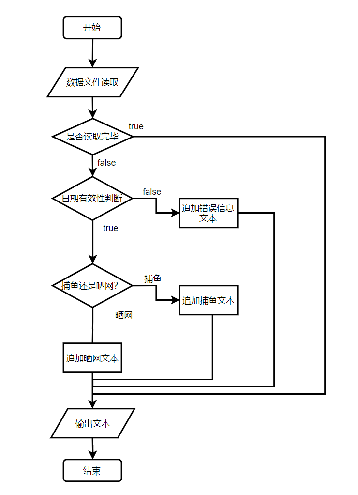
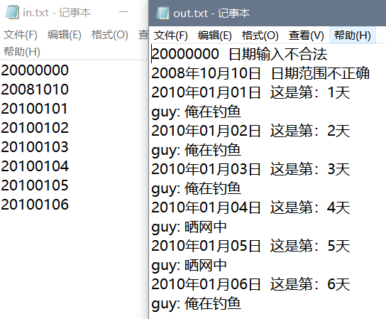

---
title: 程序设计练习——三天打鱼两天晒网
layout: post
tags:homework 作业 java
feature: 'http://jlwebs.github.io/img/3tdy2tsw-3.png'
category: null
---
 程序设计练习——“三天打鱼两天晒网”

#### question
 *中国有句俗语叫*
> “三天打鱼两天晒网”。

*某人从2010年1月1日起开始“三天打鱼两天晒网”，问这个人在以后的某一天中是“打鱼”还是“晒网”。*

---------------------------------------------------------------------
#### begin

分析过程：
首先，加载文件使用字节流转换到字符流，最后通过BufferedReader一行行读取出来，性能更高；
然后，使用Date类表达日期，使用SimpleDateFormat格式化读取和输出时间，
关键点第一个在于如何判断日期合法性，涉及年份以及数字有效检验，以下情况：

*1：由于日期有非法字符导致的parse过程异常而不合法*

*2：由于parse转化会导致越界和负数自动归化日期，我们需要满足严格格式，故再format和原字符串比较判断 *

*3：日期范围不正确，我们要求2010年以后时间才能正确计算，通过Date类转Calendar类，获取Year字段进行判断 *


:expressionless:下面是代码:sweat_drops:
```java
    public class FishOrPrepare {
    	/**
    	 *  题目：三天打鱼两天晒网
    	 **/
    	public static void main(String[] args) throws ParseException  {
    		/* 
    		 	加载文件使用字节流转换到字符流，最后通过BufferedReader一行行读取出来，性能更高
    		 */
    		BufferedInputStream biss = null;
    		InputStreamReader isr = null;
    		BufferedReader br = null;
    		String str = "";
    		String out = "";
    		final String path = "D:\\Program Files (x86)\\QQ\\330639889\\AppWebCache\\";
    		try {
    			biss = new BufferedInputStream(new FileInputStream(path+"in.txt"));
    			isr = new InputStreamReader(biss);
    			br = new BufferedReader(isr);
    			while((str = br.readLine())!=null) {
    				/* 
    			 		使用Date类表达日期，使用SimpleDateFormat格式化读取和输出时间
    				 */
    				SimpleDateFormat sdf = new SimpleDateFormat("yyyyMMdd");
    				SimpleDateFormat sdf2 = new SimpleDateFormat("yyyy年MM月dd日");
    				Date beginDate = sdf.parse("20100101");
    				Date d = null;
    				try {	
    					d = sdf.parse(str);
    
    				}catch ( Exception e){
    					/*	由于日期有非法字符导致的parse过程异常而不合法 */
    					out += str + "  日期输入不合法"+"\r\n";
    					continue;
    				}
    				if (!(str.equals(sdf.format(d)))) {
    					/* 由于parse转化会导致越界和负数自动归化日期，我们需要满足严格格式
    					 * 故再format和原字符串比较判断 */
    					out += str + "  "+"日期输入不合法"+"\r\n";
    					continue;
    				}
    				Calendar cal = Calendar.getInstance();
    				cal.setTime(d);
    				if(cal.get(Calendar.YEAR)<2010) {
    					out += sdf2.format(d) + "  " + "日期范围不正确"+"\r\n";
    					continue;
    				}
    				
    				int days = (int) ((d.getTime() - beginDate.getTime()) / (1000*3600*24));
    				out += sdf2.format(d)+"  "+"这是第："+(days+1)+"天"+"\r\n";
    				int result = days % 5;
    				if(result>=0 &&result<=2)
    					out += "guy: 俺在钓鱼"+"\r\n";
    				else
    					out += "guy: 晒网中"+"\r\n";
    			}
    			writeOut(path+"out.txt",out);
    			System.out.println("完成！查看out.txt文件结果");
    		}catch (FileNotFoundException e) {
    			System.out.println("找不到指定文件");
    		} catch (IOException e) {
    			System.out.println("读取文件失败");
    		}finally {
    			try {
    			     br.close();
    			     isr.close();
    			     biss.close();
    			    // 关闭的时候最好按照先后顺序关闭最后开的先关闭
    		   }catch (Exception e) {
    			   System.out.println("关闭文件流出错");
    		   }
    		}
    	}
    	public static void writeOut(String file, String conent) {   
    		/*	文件写出函数 */
            BufferedWriter out = null;   
            try {   
                out = new BufferedWriter(new OutputStreamWriter(new FileOutputStream(file, false)));   
                out.write(conent);   
            } catch (Exception e) {   
                e.printStackTrace();   
            } finally {   
                try {   
                if(out != null){
                out.close();   
                    }
                } catch (IOException e) {   
                    e.printStackTrace();   
                }   
            }   
        }   
    }
```

程序流程结构如下：



运行结果:



`homework` -  `2018/8/30 20:40 `
