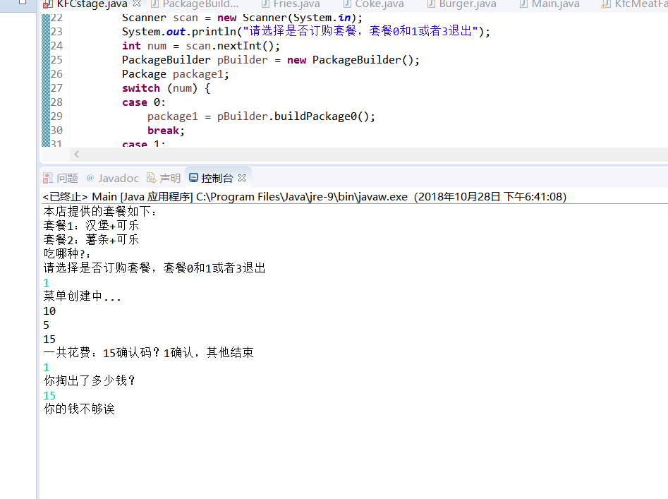
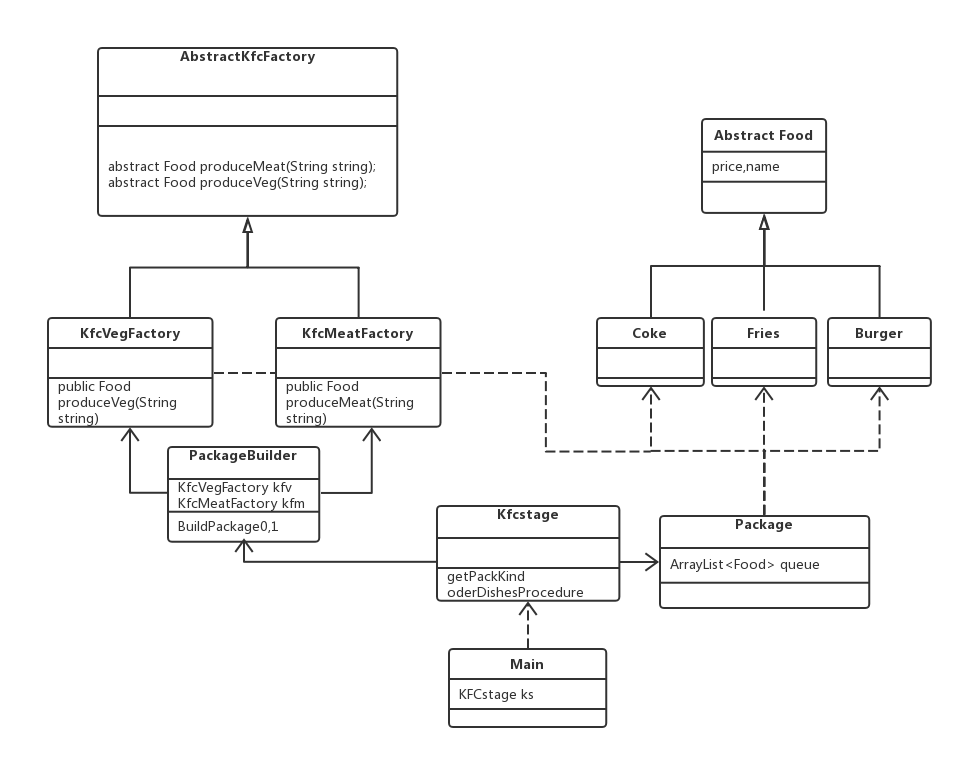

KFC点餐系统
建造者模式+抽象工厂模式+普通工厂模式+单例模式




```java
//抽象工厂模式，负责各个加工部门
public abstract class AbstractKfcFactory {
	public abstract Food produceMeat(String string);
	public abstract Food produceVeg(String string);
}
```

```java
public class KfcMeatFactory extends AbstractKfcFactory{


	@Override
	public Food produceMeat(String string) {
		// TODO 自动生成的方法存根
		switch (string) {
		case "汉堡":
			System.out.println("汉堡");
			return new Burger();
		default:
			return null;
		}
	}

	@Override
	public Food produceVeg(String string) {
		// TODO 自动生成的方法存根
		return null;
	}
}

```

```java

//普通工厂模式，负责各个菜品生产
public class KfcVegFactory  extends AbstractKfcFactory{

	@Override
	public Food produceMeat(String string) {
		// TODO 自动生成的方法存根
		return null;
	}

	@Override
	public Food produceVeg(String string) {
		// TODO 自动生成的方法存根
		switch (string) {
		case "可乐":
			return new Coke();
		case "薯条":
			return new Fries();
		default:
			return null;
		}
	}
}
```

```java
//饿汉式KFC前台 单例模式，顾客必须通过KFC前台点餐
public class KFCstage {
	private static KFCstage Instance = new KFCstage();
	private KFCstage(){}
	public static KFCstage getInstance() {
		return Instance;
	}
	public void oderDishesProcedure()
	{
		System.out.println("本店提供的套餐如下：");
		
		System.out.println(getPackKind(0));
		System.out.println(getPackKind(1));
		System.out.println("吃哪种?：");
		Scanner scan = new Scanner(System.in);
		System.out.println("请选择是否订购套餐，套餐0和1或者3退出");
		int num = scan.nextInt();
		PackageBuilder pBuilder = new PackageBuilder();
		Package package1;
		switch (num) {
		case 0:
			package1 = pBuilder.buildPackage0();
			break;
		case 1:
			 package1 = pBuilder.buildPackage1();
			break;
		default:
			System.out.println("你离开了KFC！");
			return;
		}
		System.out.println("一共花费："+package1.getTotalPrice()+"确认码？1确认，其他结束");
		 num = scan.nextInt();
		switch (num) {
		case 1:
			System.out.println("你掏出了多少钱？");
			num = scan.nextInt();
			if (num-package1.getTotalPrice()>=0) {
				System.out.println("支付成功，剩余："+(num-package1.getTotalPrice()));
			}else {
				System.out.println("你的钱不够诶");
				return;
			}
	
			break;
		default:
			System.out.println("你离开了KFC！");
			return;
		}
	}
	
	private String getPackKind (int kind) {
		switch (kind) {
		case 0:
			return "套餐1：汉堡+可乐";
		case 1:
			return "套餐2：薯条+可乐";
		default:
			break;
		}
		return null;
		
	}
}

```

```java
public class Package {
	private int totalPrice = 0 ;
	ArrayList<Food> queue = new ArrayList();
	public int getTotalPrice() {
		return totalPrice;
	}
	public void setTotalPrice(int totalPrice) {
		this.totalPrice = totalPrice;
	}
	public ArrayList<Food> getQueue() {
		return queue;
	}
	public void setQueue(ArrayList<Food> queue) {
		this.queue = queue;
	}
	
	void addDish(Food t) {
		queue.add(t);
		totalPrice+=t.getPrice();
		System.out.println(totalPrice);
	}
	
}
```

```java
//菜单建造者，建造者通过工厂创建菜品组装
public class PackageBuilder {
	private KfcVegFactory kfv = new KfcVegFactory();;
	private KfcMeatFactory kfm = new KfcMeatFactory();
	public PackageBuilder () {
		System.out.println("菜单创建中...");
	}
	public Package buildPackage0() {
		Package pk = new Package();
		pk.addDish(kfm.produceMeat("汉堡"));
		pk.addDish(kfv.produceVeg("可乐"));
		return pk;
	}
	public Package buildPackage1() {
		Package pk = new Package();
		pk.addDish(kfv.produceVeg("薯条"));
		pk.addDish(kfv.produceVeg("可乐"));
		return pk;
		
	}
}
public class Main {
	public static void main(String[] args) {
		KFCstage ks =  KFCstage.getInstance();
		ks.oderDishesProcedure();
	}
}
```

这次作业只采用了创建型设计模式，工厂和建造者模式结合顺序是要根据情况的

如果是工厂生产手机，建造者组装手机，那么FACTORY应该依赖BUILDER。

但如果工厂生产零件，建造者创建订单，那么BUILDER应该依赖FACTROY。

同理KFC也是，于是结合起来了。

单例模式如果没有特殊要求使用饿汉式即可，缺点是浪费内存，但比懒汉式不支持线程安全要通用

即便加锁的懒汉式也会因为synchronize引入造成性能阻塞，更多优化方案自行查阅
---------
题外话：设计模式设计初衷都是对C++以及JAVA的，随着语言发展，设计模式存在必要性减弱，但是了解并

掌握一些设计架构还有有帮助的，尤其是对架构师而言

-----------
`kfc homework`-`2018年10月28日`