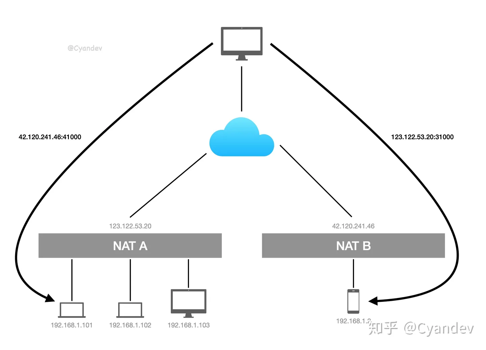
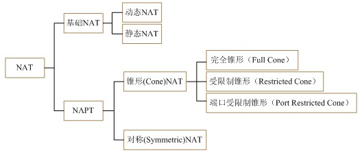

---
layout: post
title: "p2p技术之udp打洞、nat类型"
date: 2023-12-10
categories: jekyll
tags: ['🥁-Network']
comments: true
---

P2P 通信最大的障碍就是 NAT（网络地址转换），NAT 使得局域网内的设备也可以与公网进行通讯，但是不同 NAT 下的设备之间通讯将会变得很困难。UDP 打洞就是用来使得设备间绕过 NAT 进行通讯的一种技术。

- 首先打洞p2p交流的实现是基于NAT转换完成的
- 打洞前，需要一个公网服务器作为公共注册点，P2P通信双方把自己应用的通讯端口和外网ip（所属NAT设备ipv4地址）提交到registration中心
- 打洞，是利用了NAT把内网设备和公网通讯的原理用成了 和 另一个NAT设备通信（看成公网了），当然中间需要让NAT设备完成NAT转换，也就是记录发包走向映射表的建立，具体如下：
:::success
！ 最关键的一步，打洞。
设备 1 向 42.120.241.46:41000 发一个包，NAT B 自然能接收到这个包，然而它不知道来自 NAT A 的包应该发给谁，因此 NAT B 将这个包舍弃。但是由于设备 1 向 42.120.241.46:41000 发过包，NAT A 会记录：**以后来自 42.120.241.46:41000 的包都发给设备1**。
设备 2 也做相同的操作，让 NAT B 也知道：**以后来自 123.122.53.20:31000 的包都发给设备 2**。
至此，NAT A 与 NAT B 都互相为对方保留了端口，就可以愉快地通讯了。

:::
【其他】

- UDP打洞是需要网络拓扑结构支持才行的
   - 这项技术需要一个圆锥型NAT设备才能够正常工作。对称型NAT不能使用这项技术。
- TCP打洞和UDP打洞区别
   - 

【NAT类型划分】

