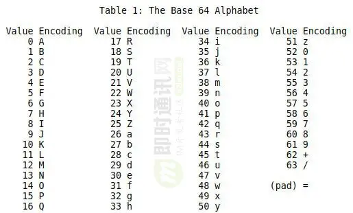
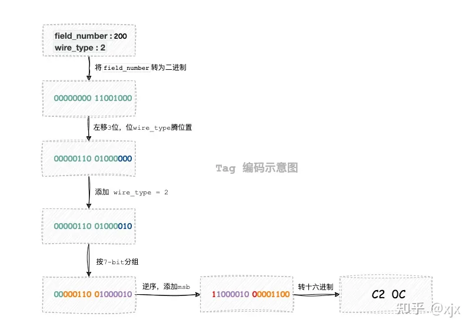

---
layout: post
title: "从base64到protobuf"
date: 2023-12-10
categories: jekyll
tags: ['🥁-OS']
comments: true
---

**1.base64规则**
> ## **Base64的由来**
> Base64算法最早应用于解决电子邮件传输的问题。早期，由于“历史问题”，电子邮件只允许ASCII码字符。如果要传输一封带有非ASCII码字符串的电子邮件，当它通过有“历史问题”的网关是就可能出现问题。
> 这个网关很可能会对这个非ASCII码字符的二进制位做调整，即将这个非ASCII码的8位二进制码的最高位置为0。此时，用户收到的邮件将会是一封纯粹的乱码邮件，基于这个原因就产生了Base64算法。

编码表：

原来一个字节8位，划分6bits为单位解析，也就是原来3字节=24位正好解析成4个base64符号，占空间右3bytes提升到4bytes，宏观上会表现成3byte+3byte +···+ 最后一节；
如果最后一段不是刚好6bits呢？NO，base64是按照4换3的策略来的，只要 0<最后一节<3，那就会被强行padding = 来补齐。
举例，比如2字节数据 8+8 → 6+6+4 → 6+6+6(4个有效bits)+pad*1
> 在base64里，由于输入数据都是字节流，不是按bit位单位传输，所以，即便最后那个6（4+2）末尾被填充了2个0还原时候也不会受影响，正确切割按8bit还原就行了；
> **Q: **至于为什么强制要求base64长度必须是4的倍数，不惜引入=来补齐呢？

> **其实末尾用=符号补齐完全没有必要，就是硬凑长度4的整倍数，没有=我依然可以通过mod 4得到需要几个等号，不影响解析，但其实也有一些好处①**

> **引用①：**在硬件性能水平不高的时代，强制要求输入可以被特定数整除可以简化代码中的条件判断，提高 inner loop 性能。
> 以 glibc 的 strlen 实现为例，每次读取 32bit 整数而不是只读取一个 byte，是常见的汇编手动优化技巧，简化了代码；

**2.base128**
base128是为了解决4换3字节，空间利用率只有75%的问题的，base128如果可行, 浪费率可降低到12.5%；
> ascii里打印字符只有96个，这里会引出base128的问题，怎么够表示呢，加上非打印的控制字符一共也就128个ascii字符，虽说非打印字符也定义了对应特殊符号只是不太美观


> 即使不考虑 pad需要128+1个字符，ascii 中包含了一些不可以正常打印的控制字符，编码之后的字符还可能包含会被不同操作系统转换的换行符号（10 和 13）。因此，Base 64 至今依然没有被 Base 128 替代。

> Base 64 的规则因为上述限制不能完美地扩展到 Base 128，所以现有基于 Base 64 扩展而来的编码方式大部分都属于变种：如 LEB128（Little-Endian Base 128）、 Base 85 （Ascii 85），以及本文的主角：Base 128 Varints。
链接：https://www.zhihu.com/question/585411183/answer/2907926748

**3.protobuf**
主要是设计用来跨平台、高效的二进制序列化协议
> 对比C直接发送结构体的优势是跨语言、省空间（速度比不过结构体）  对比JSON等的优势是效率高（但可读性

- **Base128 Varints 编码规则**

作为Protobuf的基本底层编码逻辑：
去除高位0, 按7bits分组解析，最高位bit记录最后一个数据还是中间数据，采用小端保存（逆序bit存入）
Protobuf针对不同数据类型以及数据范围采用策略不同，以下是涉及到的多类编码辅助处理不同情况：

- **ZigZag 编码**

解决负数占用高问题，由于负数反码导致高位填充1，采用zigzag把负数转为正数
映射规律：正数n变 2* n ， 负数n变 -2* n +1；就是奇偶移位，但是负数被翻倍了，因此范围会被限制；比如8bits的int8类型，实际支持范围减半，当然protobuf肯定不会这么做，多策略好处把大数额外策略进行处理了。

- 32-bit & 64-bit

单纯的32位和64位，用于处理protobuf无法压缩的数据范围，例如 10000000, 7位分组后变成两组了，需要2个字节表示原来1byte了；这时候就用这个pure类型；

- **Length-delimited编码 **

用于对string类型编码，把长度附加在了数据头部；
"Tag - Length - Value" 是一种常见的数据编码结构，用于在长度限定编码中传输或存储数据。这种结构在许多序列化格式中都有应用，其中每个字段的数据被编码为三个主要部分：标记（Tag）、长度（Length）和实际值（Value）。
介绍：Tag生成规则

举例:
```json
message MyMessage {
    int32 field1 = 1;
    string field2 = 2;
}
```

1. field1 (int32)："wire type" 是 Varint（0x0）。Varint 用于编码变长整数，如 int32，它是一种紧凑的编码方式。
2. field2 (string)："wire type" 是 Length Delimited（0x2）。Length Delimited 用于编码长度限定的数据，如字符串。在编码时，会先写入字符串的长度，然后是字符串的 UTF-8 编码。
3. "field1" 和 "field2" 分别有 field_number"为 1 和 2。当编码这个消息时，编码器会使用 "field_number" 和字段的类型信息一起生成一个唯一的 "tag"，这个 "tag" 包含了 "field_number" 和字段的 "wire type"。接收方可以使用 "tag" 中的 "field_number" 来识别并正确解码字段。
> 1. **优点**：
>    - 在不需要依赖分隔符或其他终止标记的情况下，接收方可以高效地传输和存储数据，因为它知道要期望多少数据。
>    - 可用于编码结构化数据、二进制数据或任何其他类型的数据。
> 2. **缺点**：
>    - 由于长度前缀的存在，会引入额外的开销。如果长度前缀大于实际数据，这种开销可能会相当大。
>    - 由于需要管理长度信息，编码和解码过程可能会变得更加复杂。

- **packed 编码**

其实是L-D编码衍生优化，把
Tag - Length - Value
Tag - Length - Value - 
Tag - Length - Value - ··· Tag - Length - Value ······
这种重复的T-L-V - (TLV) 类型字段 优化成T-L-V一个大package
> 原先的 repeated 字段的编码结构为 **Tag-Length-Value-Tag-Length-Value-Tag-Length-Value...**，因为这些 Tag 都是相同的（同一字段），因此可以将这些字段的 Value 打包，即将编码结构变为 **Tag-Length-Value-Value-Value...**。


- **Protobuf中重复消息的编码规则**

repeat字段是怎么实现类似容器vector的追加呢，特别是里面元素个数如何解析出来：
假设接收方的 proto3 中定义了某个字段（假设 field number=1），当接收方从字节流中读取到多个 field number=1 的字段时，会执行 merge 操作。

**merge 的规则如下：**

- _**1）**_如果字段为不可分割的类型，则直接覆盖；
- _**2）**_如果字段为 repeated，则 append 到已有字段；
- _**3）**_如果字段为嵌套消息，则递归执行 merge；

如果字段的 field number 相同但是结构不同，则出现 error。

这样repeated字段的值就会被追加apped到特定容器下，同时统计出property size；
[IM通讯协议专题学习(四)：从Base64到Protobuf，详解Protobuf的数据编码原理-IM开发/专项技术区 - 即时通讯开发者社区!](http://www.52im.net/thread-4093-1-1.html)
【警惕性能点】由于repeated的追加特性完成的容器insert操作，注定性能差，当你的repeated数量很大，考虑改用字节数组bytes，可以批量一次性载入内存，然后根据内存分布自己访问指针来快速访问这个“数组”

- proto数据结构
| **Protobuf 类型** | **C# 类型** |
| --- | --- |
| double | double |
| float | float |
| int32 | int |
| int64 | long |
| uint32 | uint |
| uint64 | ulong |
| sint32 | int |
| sint64 | long |
| fixed32 | uint |
| fixed64 | ulong |
| sfixed32 | int |
| sfixed64 | long |
| bool | bool |
| string | string |
| bytes | ByteString |

