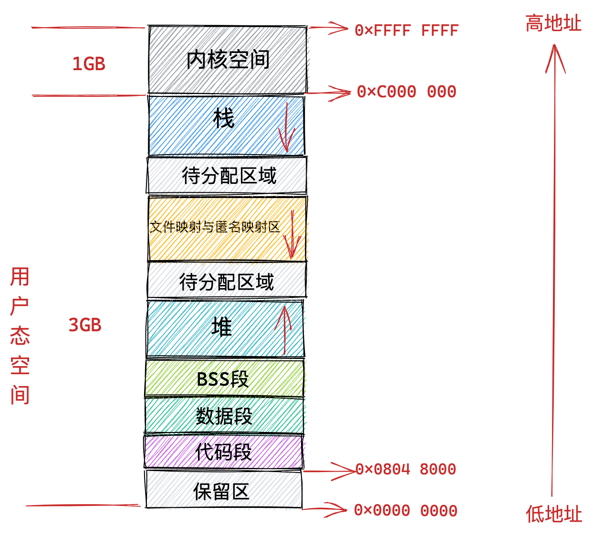

---
layout: post
title: "虚拟内存空间分布专题"
date: 2023-12-10
categories: jekyll
tags: ['🥁-OS']
comments: true
---

1.基础布局

2.内存的segment 与 PE 文件结构中section 的对应关系
> 程序是由若干个逻辑分段组成的，如可由代码分段、数据分段、栈段、堆段组成。**不同的段是有不同的属性的，所以就用分段（_Segmentation_）的形式把这些段分离出来。**
> 磁盘文件中的段我们叫做 Section，内存中的段我们叫做 Segment，内存区域。

段空间（segments）对应到 PE 文件结构中的不同部分（sections）。下面是一些常见的 PE 文件部分和它们对应的 section：

1. **代码段（Code Segment）** 对应 **.text** section：
   - **.text** 包含程序的可执行代码，通常是机器代码指令。这是程序的主要执行部分。
2. **数据段（Data Segment）** 对应 **.data** 和 **.rdata** sections：
   - **.data** 包含程序的已初始化的全局和静态数据变量。
   - **.rdata**（只读数据）包含程序的只读常量数据，如字符串字面量。
3. **堆（Heap）** 和 **栈（Stack）** 不对应特定的 PE 文件 section：
   - 堆和栈是在程序运行时动态分配和管理的内存区域，它们不会直接映射到 PE 文件的特定 section 中。它们的大小和位置在运行时由操作系统和运行时库管理。
4. **共享库区域（Shared Libraries）** 对应 **.idata** 和 **.rdata** sections：
   - **.idata**（导入表）包含用于导入外部共享库的信息，如函数和符号名称。
   - **.rdata** 可能包含共享库的只读数据，类似于程序的只读数据段。
5. **内核空间（Kernel Space）** 不对应 PE 文件 section：
   - 内核空间包含操作系统内核的代码和数据结构，它不会直接映射到 PE 文件的 section 中。用户程序无法直接访问内核空间，必须通过系统调用与内核交互。
- 磁盘文件中的这些 Section 会在进程运行之前加载到内存中并映射到内存中的 Segment。通常是多个 Section 映射到一个 Segment。
- 比如磁盘文件中的 .text，.rodata 等一些只读的 Section，会被映射到内存的一个只读可执行的 Segment 里（代码段）。而 .data，.bss 等一些可读写的 Section，则会被映射到内存的一个具有读写权限的 Segment 里（数据段，BSS 段）
