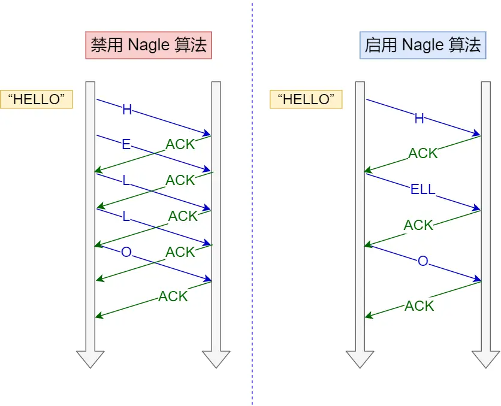
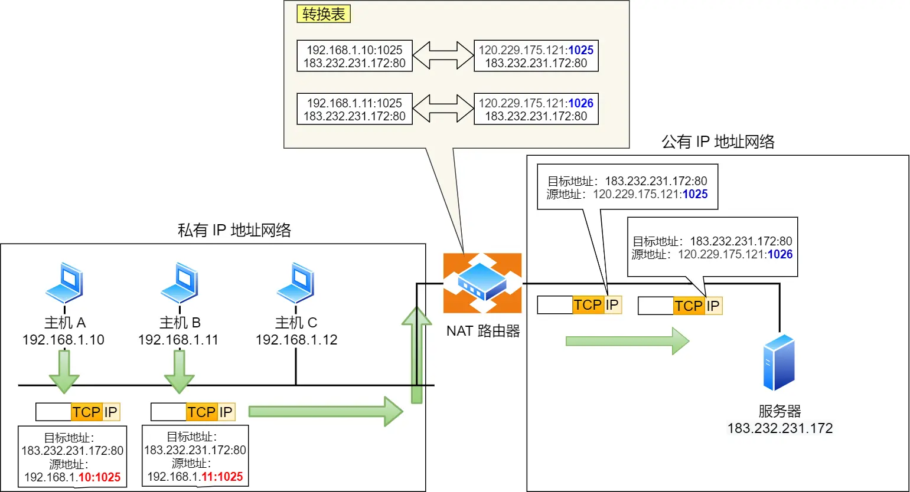

#### Nagle
TCP的报文太小时候，避免低效大量tcp报文
对其进行累积到MSS再发送一个MSS单位的数据包。
为了避免造成延迟，需要仅对未确认的数据进行缓存：
发送条件：
:::success

- 条件一：要等到窗口大小 >= MSS 并且 数据大小 >= MSS；
- 条件二：收到之前发送数据的 ack 回包；
- 条件三：一开始由于没有已发送未确认的报文
:::
```c
if 有数据要发送 {
    if 可用窗口大小 >= MSS and 可发送的数据 >= MSS {
    	立刻发送MSS大小的数据
    } else {
        if 有未确认的数据 {
            将数据放入缓存等待接收ACK
        } else {
            立刻发送数据
        }
    }
}
```

#### NAT

	应用程序无感知，由NAT设备（路由器）完成内网ip+端口的NAT表转换映射并修改IP包的Source IP，以暴露在公网上。一般来说家庭网络是无法完成NAT的，因为NAT公网出口设备是在骨干网关，家庭无权设置NAT映射，这时候就需要借助NAT穿透，一种主动式暴露技术。
相关技术还有:DMZ主机
DMZ是将局域网中的某台主机直接暴露在互联网中，对外而言，这台主机拥有你的互联网IP，互联网所有对你公网IP的访问直接会转移到你的这台主机，而不受防火墙限制；而NAT则是通过端口隐射的方式，把局域网中的特定主机的指定端口开放给互谅网，只有当互联网访问你公网IP的指定端口的时候，这个访问才会被转移到这台主机。
DMZ主机是为了实现网络隔离，2个网络之间的缓冲区域。其访问权限比较特别。比如一个校园网和Internet互联，可以设置一个DMZ，让校园网和Internet不可以直接互相访问，而只能通过DMZ。而DMZ不能访问校园网。
#### NAT 穿透
_NAT 穿透技术_
> ## 内网穿透的原理
> 对于内网来说，其不是不能主动访问公网端口，而是不能反过来有效的被公网访问。内网穿透的主要思路就是利用这一点，让在内网的节点主动访问一个拥有公网IP地址的服务器，并由中间服务器搭桥，打通经过该服务器从其他主机到NAT之后节点的隧道。

NAT 穿越技术拥有这样的功能，它能够让网络应用程序主动发现自己位于 NAT 设备之后，并且会主动获得 NAT 设备的公有 IP，并为自己建立端口映射条目，注意这些都是 NAT设备后的应用程序自动完成的。
也就是说，在 NAT 穿透技术中，NAT设备后的应用程序处于主动地位，它已经明确地知道 NAT 设备要修改它外发的数据包，于是它主动配合 NAT 设备的操作，主动地建立好映射，这样就不像以前由 NAT 设备来建立映射了。
:::danger
_路由需要有公网IP设置的路由映射才生效（包括UPnP、DMZ），而软件穿透则无需公网IP都可以使用（如花生壳、nps、nat123网）。_
:::
说人话，就是客户端主动从 NAT 设备获取公有 IP 地址，然后自己建立端口映射条目，然后用这个条目对外通信，就不需要 NAT 设备来进行转换了。
_NAT 穿透开源项目：nps_
通过宿主机开启nps client，以及自己一台公网服务器作为NAT设备，如腾讯云，在其上运行nps server，通过clinet <-> server的双向通信模拟完成NAT映射功能（及内穿透）
_NAT穿透的常见实现方式_主要包括两种：
（1） 通过路由器支持端口映射从而实现P2P通信，该类包括upnp和nat-pmp，优点在于易于实现、延迟小、对服务器无负担，缺点在于需要路由器支持并打开相应功能。
（2） STUN/TURN/ICE协议簇，通过服务器的协调作用实现P2P通信。优点在于稳定可靠，缺点在于需要多次通信，在最坏情况需要依靠中继完成通信，对于游戏服务器来说会有一定的负担。
本文重点在于分析ICE架构的实现方式、当前的ICE开源项目以及可能的实现方式。
