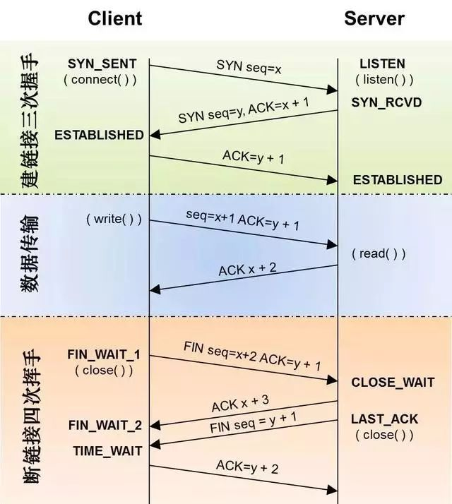
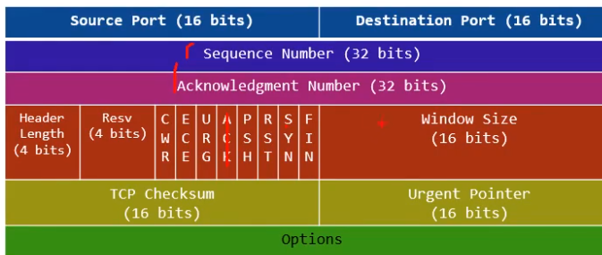
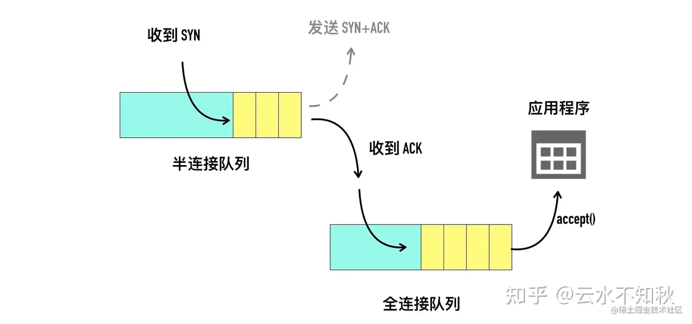
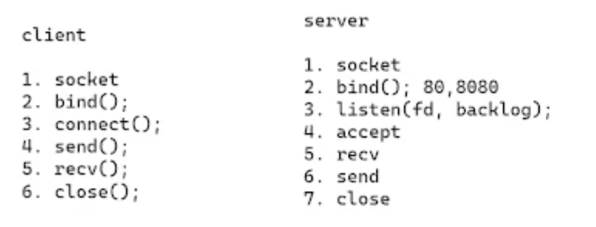
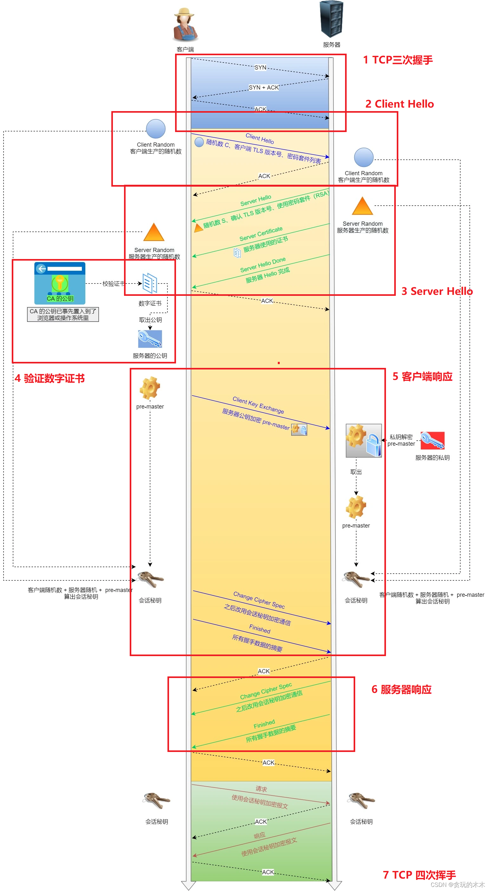
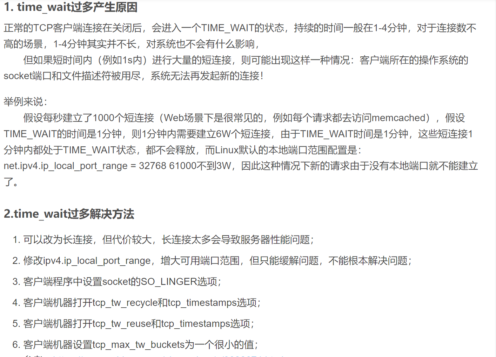

https TLS握手+会话密钥过程 （图解）

- 握手过程：

客户端connect 开启第一次握手
listen()获取到结果 第二次握手，进入半连接队列
最后一次ack后进入established，进入全连接队列（内核通过**五元组**绑定找到对应的半连接队列，然后搬迁）
 

- 挥手过程：

recv返回0代表开始关闭，前两次挥手已完成
close()开始第三次挥手；
请求关闭端进入TIME_WAIT阶段
（为了清空历史连接，开启新的连接）

- backlog两种理解
   - 1.全连接队列长度（linux最新版本）
   - 2.全连接+半连接队列长度

[异常]

- TIME_WAIT分别客户端、服务端出现大量，什么原因？

客户端主动关闭情况下： 高并发+短连接过多。

server主动关闭下，主要是代码逻辑问题，导致大量连接主动关闭；

- 客户端出现大量FIN_WAIT原因？

等同于服务端进入大量状态，等于服务端没有及时调用close函数；

[问题]

- 能否TCP\UDP绑定相同端口下同时通信

  可以，五元组区别。

- 端口复用

有时候重启服务器会出现：**Address already in use**
说明还在4次挥手结束后的Time_wait阶段；可以开启端口复用option： 
SO_REUSEADDR 作用是：**如果当前启动进程绑定的 IP+PORT 与处于TIME_WAIT 状态的连接占用的 IP+PORT 存在冲突，但是新启动的进程使用了 SO_REUSEADDR 选项，那么该进程就可以绑定成功**

