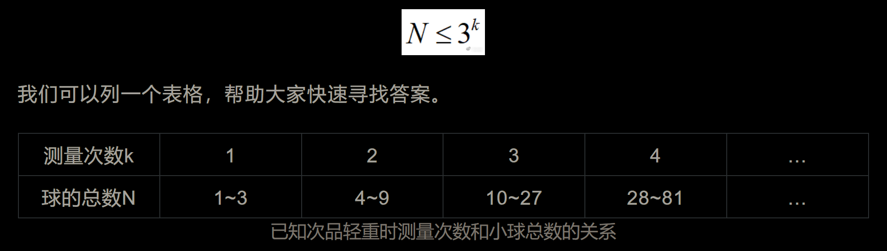
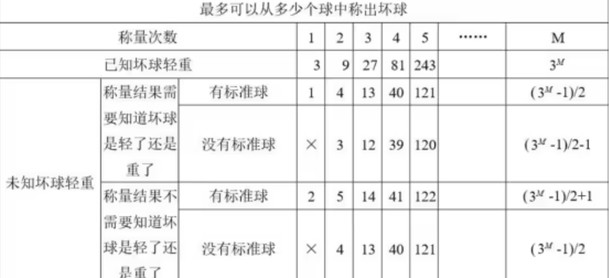
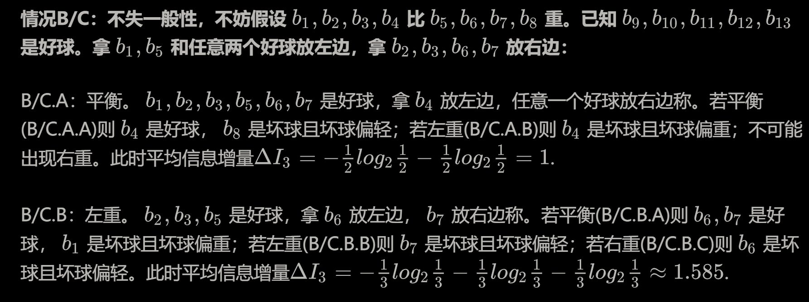

### [1] 2次天平称出8个小球里质量偏大的那一个

分堆 3 3 2；天平三种信息对应三种利用情况，最好就是三分法；
一般化：3^(k-1)+1 ~ 3^k 个球的寻找问题，k次称重能够解决；
分类讨论即可；

### [2] 3次天平12个球找不同的1个
有12颗外观一模一样的小球，其中11颗的质量相同，而另一颗则不知是比其他小球重还是轻；现在可用的工具是一台天平称，要求称3次找出这颗与众不同的小球，请简要说明你的称法．
> _【为什么三分法】：充分发挥天平三个状态、结果分流导向以实现目标范围缩减最大化；_

思考：我们先想最小集，1个球无须比较，2个球找不出来，3个球需要几次？
天平仍然是3个状态，但是球自身变成2个状态，无法在天平A>B,A<B两种情况同时精确区分了；
因此需要借助辅助：正常球，用以比较区分；
-----------------------------------------------
最小集：已知正常球，未知球2个，1次即可找到次品球，但不知道次品球轻还是重；
如果题目要求判断次品轻重：那还是需要2次；
-----------------------------------------------
4个球呢？尽可能均摊：1、1、2；第一次称重，范围缩为2个球；第二次称重即解决；
注意：2、2这样分摊是没有必定没有相等的，等于主动丢弃了一条三分路信息
假设 A、B > C、D
重新摆放： A C ----  B D 若为＞，则 AD中内鬼，若＜ 则BC中内鬼。等于这种第二次才把内鬼缩到2个范围；
------------------------------------------------
5个球，三分均摊：2、2、1；第一次最糟糕是2和2不平衡，只能把内鬼范围缩到4个球里，套用之前4球情况即可
一共最多3次；
....................直到
8个球：2、2、4；这时候到了套用4球极限了；
.......  
根据表格可知，没有标准球（砝码）情况下，最多能k=3次支持13球下解决找到次品，
我们按照4、4、5分组我们看看3次的方案怎么来的；
_【1】_**_我们先把最简单情况先分析了：_**
第一次就直接平衡，嫌疑只在9、10、11、12、13里了，范围缩减到5个球；
这时候我们按12球的思路处理，此时已经有了8个基准球，这里看做4个嫌疑球即可，
此时 →	左边：取9、10	     ；	 右边：取11 + 1个基准球；

- 此时平衡-》再去12号和基准比较》平衡则13为次品且不知道轻重，否则12号为次品且知道轻重；
- 此时不平衡-》3个球找内鬼，1次搞定；这里就会首次用到《等号两次对比效力相同续筛法》：

最后一次 比较对象是有讲究的：左边9 右边10
先举例说明：假如此时左边重，即 9、10 > 11 + 基准  （基准不等式①）
> 《等号两次对比效力相同继续筛法》：根据基准不等式，下一次出现的不等式，在符号一致下，同侧出现过的元素会成为那个次品嫌疑对象，相反的，出现在异侧会被排除嫌疑；

也就是说如果内鬼在9、10里面，那么9或者10一定偏重|或者11偏轻，那么如果后面推断出9或者10偏轻|或者11偏重那就矛盾了，不可能是内鬼把它们排除掉，只保留一侧出现过的元素；
现在我们反面说下为什么要选择左边9 右边10，因为选9和11 或者 10和11 有可能包含了次品，会导致等式成立，但是这样只是把次品范围从3个降低到了2个，没有彻底找到次品；
正面讲解：假如后续：
 9 > 10 ： 和①比较，9在同侧，10在异侧嫌疑排除，只能是9且偏重；
10 > 9：和①比较，10在同侧，9在异侧嫌疑排除，只能是10且偏重；
10 = 9：次品是11且偏轻
_**【2】复杂情况继续：**_
> 核心《续筛法》没有改变，只是你要规划好天平两端如何交错摆放，同时保留几个元素作为Cond.3（平衡）时候的比较范围；

第1次没有平衡，此时内鬼范围从13球只缩减到了8个球中；
assumption no.1：1、2、3、 (4 >  5、6、7、 (8 
assumption no.2：1、5、（2个基准） ？  2、3、6、7 
内鬼范围从8个缩减到了 1、6、7 （>） 或者 2、3、1（<) 或者 4、8（=）
assumption no.3： 6 >7
conclusion：7在同侧，7是内鬼偏轻；

==================================================
:::success
方法不唯一，核心思路同样是不等式两边一致的需要保留内鬼身份进一步比较；通过综合信息比对完成核心末尾次数；；提供另一种比较法：
:::
分三组：每组四个，第一组编号1-4，第二组5-8，第三组9-12．
第1次称：天平左边放第一组，右边放第二组．
1．第一种可能：平衡．则不同的在第三组．
接下来可以在左边放第9、10、11号，右边放1、2、3号三个正常的．(第2次称)
①如果平衡，则12号是不同的；(结束x2)
②如果左重右轻，则不同的在9、10、11号中，而且比正常球重．再称一次：9放左边，10放右边，如果平衡，则11号是不同的；如果左重右轻，则9号是不同的，如果右重左轻，则10号是不同的．(第3次称，结束)
③如果左轻右重，道理同②
2．第二种可能：左重右轻，则不同的在1-8号中，但不知比正常的轻还是重．
1 2 3 4         5  6 7 8              9 10 11 12
第2次称：左边放1、2、5号，右边放3、6、9号．
①如果平衡．则不同的在4、7、8中．可以称第三次：左边放4、7，右边放9、10．如果平衡，则8是不同；如果左重右轻，则4是不同；如果左轻右重，则7是不同．(第3次称)
②仍然左重右轻．则不同的在位置没有改变的1、2、6中．可以称第三次：左边放1、6，右边放9、10．如果平衡，则2是不同； 如果左重右轻，则1是不同；如果左轻右重，则6是不同．(第3次称)
③左轻右重．则不同的在5、3、中，因为只有它们改变了原来的位置．可以称第三次：左放5，3，右放9，10．如果左轻右重，则5是不同，如果左重右轻，则3是不同．(第3次称)
3．第三种可能：左轻右重，道理同②
至此，不论发生任何情况，称三次都可以找出不同，而且知道比正常的轻了还是重了．
