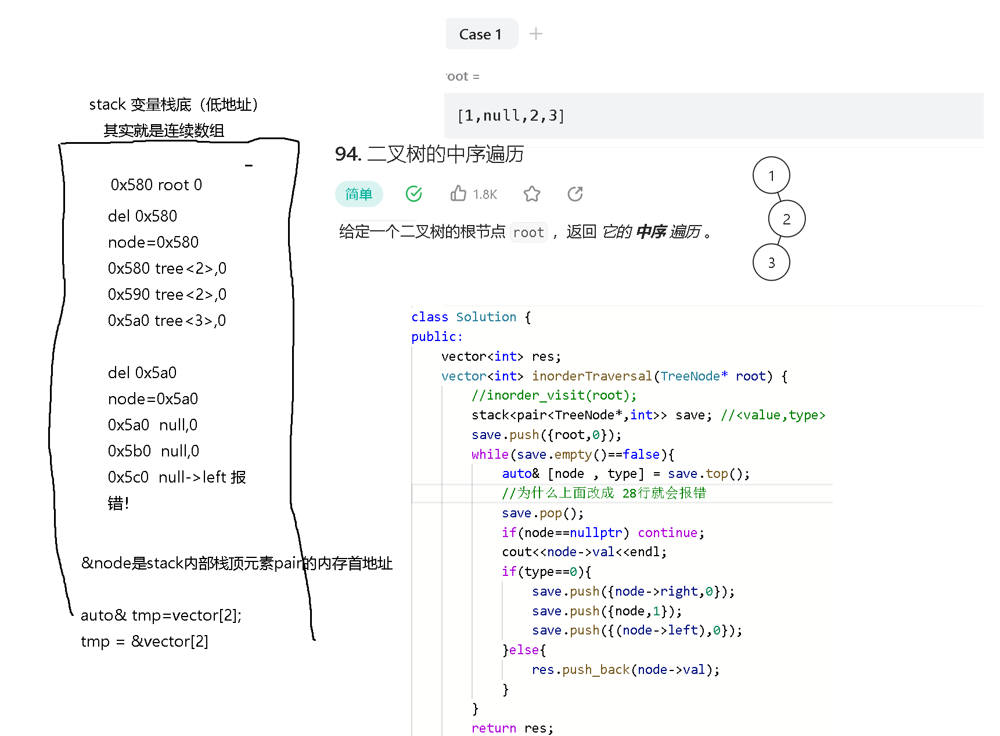
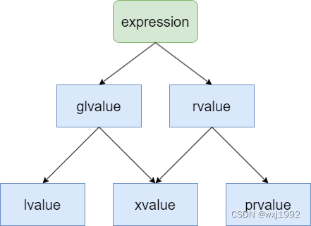
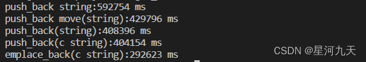

---
layout: post
title: "C++11 新特性"
date: 2023-12-10
categories: jekyll
tags: ['🥁-CPP']
comments: true
---

#### 1.lambda 仿函数
   1. 类模拟lambda
```cpp
auto make_lambda(int a, int b)
{
    class Lambda {
    public:
    int operator()(int x) const {
        return a * x + b;
    }
};
    return Lambda{};
} 
```

   2. 闭包[]内几种传递方式
      1. [var] 值传递外部变量var
      2. [&] 全部外部变量引用方式捕获
      3. [=] 全部外部变量值传递捕获
      4. [] 匿名方式捕获，不会保留改动
   3. lambda和mutable结合例子
      1. 模仿python的yield功能

mutable作用是把值传递捕获创建的临时const 副本，通过mutable设置易变性，使其可修改同时增强了它的生命周期作用域。
```cpp
#include <iostream>
#include <functional>

std::function<int()> gen_one2ten() {
    int i = 0;
    // 返回的是真正的生成器
    // 注意 mutable 关键字以允许匿名函数修改外面的局部变量
    // 表现出来的效果为变量 i 的值在匿名函数的多次调用之间会被保留
    return [=]() mutable {
        if (i < 10) {
            i++;
            return i;
        } else {
            // 返回一个特殊值表示停止继续生成
            return -1;
        }
    };
}

int main() {
    std::function<int()> one2ten = gen_one2ten();
    int x;
    while ((x = one2ten()) != -1) {
        std::cout << x << std::endl;
    }
    return 0;
}
```

#### 2.智能指针：shared_ptr、weak_ptr、unique_ptr
weak_ptr:
 	weak_ptr被设计为与shared_ptr共同工作，可以从一个shared_ptr或者另一个weak_ptr对象构造，获得资源的观测权。但weak_ptr没有共享资源，它的构造不会引起指针引用计数的增加。同样，在weak_ptr析构时也不会导致引用计数的减少，它只是一个静静地观察者。weak_ptr没有重载operator*和->，这是特意的，因为它不共享指针，不能操作资源，这是它弱的原因。但它可以使用一个非常重要的成员函数lock()从被观测的shared_ptr获得一个可用的shared_ptr对象，从而操作资源。
weak_ptr用于解决”引用计数”模型循环依赖问题，weak_ptr指向一个对象，并不增减该对象的引用计数器。weak_ptr用于配合shared_ptr使用，并不影响动态对象的生命周期，即其存在与否并不影响对象的引用计数器。weak_ptr并没有重载operator->和operator *操作符，因此不可直接通过weak_ptr使用对象。weak_ptr提供了expired()与lock()成员函数，前者用于判断weak_ptr指向的对象是否已被销毁，后者返回其所指对象的shared_ptr智能指针(对象销毁时返回”空”shared_ptr)。
shared_ptr:
共享计数，存在循环引用不能释放问题（循环引用的各个对象当一并不再使用时候，无法整体释放），所以循环引用时候改用weak_ptr。
shared_ptr 的引用计数会在以下情况下增加：
1.通过 shared_ptr 拷贝构造函数或赋值运算符创建新的 shared_ptr 对象时，引用计数会增加。
2.通过 make_shared 或 shared_ptr 构造函数创建新的 shared_ptr 对象时，引用计数会增加。
3.在使用 shared_ptr 管理的对象中，如果成员变量是指向堆上的对象的 shared_ptr，则这些 shared_ptr 引用计数会增加。
4.在使用 shared_ptr 管理的对象中，如果成员函数返回指向堆上的对象的 shared_ptr，则返回的 shared_ptr 引用计数会增加。

auto_ptr: C99遗珠了，需要了解下前世今生：
（待再看）

#### 3.结构化绑定（c++17）
for( auto& [key, val] : map) {...}
key和val**不是变量**，只是一种别名。
注意当我们使用引用时候，不是把map内每个pair<>具体的key，value引用，而是类似于
key= &pair->first, val= &pair->second;
因此一旦&pair地址处改变了，key和val也会随之改变。
一个很容易触发的例子：
stack<pair<A,B>> stk;
auto& [a, b] = stk.top();
stk.pop(); //pop后并不会立即清空栈顶元素，而是把该位置标记为未使用
//此时a和b还能访问原始数据，但当我们
stl.push({C,D}); //这时a，b立马改变了。a=C, b=D；
//因为a,b=&pair->first,&pair->second, &pair的地址已经被新来的{C,D}覆盖了。
【以下是一个经典错误例子的错误trace过程】

#### 4.move移动语义和移动构造函数
[C++引用折叠与std::move和std::forward的实现](https://zhuanlan.zhihu.com/p/580797507)

- 移动构造函数：
```cpp
class MyClass {
public:
    MyClass(MyClass&& other) noexcept {
        // 将other的资源转移到当前对象中
        // 确保other的资源不再使用
        // 如果源对象类中包含指针类型变量，需要手动设置other.pointer = nullptr；
        // 避免一种情况：当我move语义完成资源转移后，我手动对原始对象析构，会把指向内容意外清除。
    }
};
```

- move移动语义

强行左值引用转为右值**引用**，~~可以实现消亡值的数据持久化~~
原型：
```cpp
template <typename T>
typename remove_reference<T>::type&& move(T&& t)
{
	return static_cast<typename remove_reference<T>::type &&>(t);
}
```
##### 右值引用溯源
右值引用(rvalue-reference)与复制省略(Copy Elision)
以C++14及以前的标准来说，我们发现，如果直接用一个变量来接收返回值，会多一次临时对象的拷贝和析构，用常引用虽然可以减少这一次拷贝，但常引用是用const修饰的，不可修改（如果要修改的话，还是得再去拷贝构造一个新的变量）。而为了解决这个问题，C++引入了「右值引用」。
  0.即便变量的类型是右值引用，由它名字组成的表达式仍然是左值表达式。

1. 对于非平凡类型，为了保证对象的行为完整性，函数返回值会单独作为一个临时对象，如果需要在栈上使用，那么会拷贝给栈上的变量。
2. 为了希望这片临时空间能够被代码捕获到，于是允许了用常引用来绑定函数返回值。但如果这时返回值仍然保持xvalue的特性的话，会引入野指针问题，违背了「引用临时空间」的原意，因此不得不将这种情况改成lvalue，让常引用所引用的空间跟随其所在的栈空间来「延长」声明周期。
3. 又因为常引用有const修饰，不能修改对象，因此引入了「右值引用」，当用右值引用绑定函数返回值时，行为跟常引用是一致的，可以减少一次xvalue的生成，「延长」声明周期，同时还可以修改对象。
4. 又发现还是直接用变量来接收函数返回值更加直观、符合直觉，而这种情况下xvalue的生成并没有太大的必要，因此又规定了「复制省略」，来优化这一次复制。（优化之后，用变量接收函数返回值和用右值引用接收函数返回值就完全没有区别了；而用const变量接收函数返回值跟用常引用接收函数返回值也没有区别了。）

这里需要额外解释一下，上面的实例我们都添加了-fno-elide-constructors这个编译参数，其实它就是用于关闭编译器的自动复制省略的。在C++17以前，虽然语言标准是没有定义复制省略的，但编译器早早就发现了这个问题，于是做了一些定制化的优化（称为返回值优化，Return Value Optimization，或RVO），这个参数就是关闭RVO，完全按照语言标准来进行编译。而在C++17标准中，定义了复制省略的方式，因此编译器就必须按照语言标准定义的那样来处理返回值了，所以在C++17标准下，这个编译参数也就不再生效了。
[C++为什么会有这么多难搞的值类别？（下）](https://www.dgrt.cn/a/321756.html?action=onClick)
#### 5.表达式值类别
glvalue、rvalue：都是generalized，广义左值、广义右值，因为包含了xvalue
xvalue：expired value，消亡值，常常是临时表达式，如实参里的新对象；
pure rvalue = prvalue： 纯右值和lvalue类似
> 它和lvalue的区别就在于即将消亡，所以它也是有身份的，其实就是即将消亡的lvalue，表明这类对象的资源是可以被复用的


> C++的表达式的定义：由各种运算对象（operands）和运算符（operators ）组成的表明一个计算的式子，比如a + b或a.method(1) + b这种，但这里想要额外强调的是，即便没有额外的运算符，"hello word"这种[字面量](https://so.csdn.net/so/search?q=%E5%AD%97%E9%9D%A2%E9%87%8F&spm=1001.2101.3001.7020)以及单个变量名var也属于表达式。

三种基本值类型的代表种类
lvalue：变量（包括右值引用类型的）、函数（返回左值引用的函数）、数据成员
数据成员、数组名
:::success
为什么字符串字面值“hello”是左值： 字符串字面量可以认为类型是数组，当数组出现在表达式中， 根据值转变概念我们可知无论是左值数组或是右值数组都会自动转变成右值指针。之所以定义为左值可能仅仅是委员会的喜好。
C语言中,字符串字面量属于 const char *,是一个指针常量,所以不是左值，但在C++中,字符串字面量的类型是const char[N],是一个字符数组,所以是左值。
tips：凡是能用&取址的表达式都是左值表达式（位字段、寄存器变量除外）
:::

prvalue：单纯返回右值的计算表达式、取地址、字符串以外字面量
xvalue：

- 返回**类型是**对象的**右值引用**的**函数**或者重载运算符的**调用**，比如最典型的：return std::move(x)
- 往右值引用类型转的类型转换表达式，比如static_cast<char&&>(x)

[C++ 值类别(value category)循序渐进（一）值类别是什么_wxj1992的博客-CSDN博客](https://blog.csdn.net/wxj1992/article/details/126734243)
属性：
lvalue： 

- 初始左值引用
- const左值引用可以完成引用右值

prvalue：不具有多态
#### 6.push_back和emplace_back性能差别
这里探讨push_back(string&&) 版本和emplace_back模板函数之间的性能差距
push_back("mystr");
emplace_back("mystr");
> **结论：前者略慢于后者；对于string大概25%左右时间差距**
> 

原因探究：
先摆出两者的源码定义
```cpp
// push_back(string&&) function
void push_back(string&& value) {
    // 如果容器的大小已经达到了容器的容量，需要进行扩容
    if (size_ + 1 > capacity_) {
        reserve(capacity_ == 0 ? 1 : capacity_ * 2);
    }

    // 创建一个新的元素，并将其移动到容器的末尾
    new (data_ + size_) std::string(std::move(value));
    ++size_;
}

// emplace_back(string&&) function
template <typename... Args>
void emplace_back(Args&&... args) {
    // 如果容器的大小已经达到了容器的容量，需要进行扩容
    if (size_ + 1 > capacity_) {
        reserve(capacity_ == 0 ? 1 : capacity_ * 2);
    }

    // 创建一个新的元素，并将其移动到容器的末尾
    new (data_ + size_) std::string(std::forward<Args>(args)...);
    ++size_;
}
```
move源码
```cpp
template <typename T>
typename std::remove_reference<T>::type&& move(T&& arg) noexcept {
    return static_cast<typename std::remove_reference<T>::type&&>(arg);
}
```
forward源码
```cpp
template <typename T>
constexpr T&& forward(typename std::remove_reference<T>::type& t) noexcept {
    return static_cast<T&&>(t);
}

template <typename T>
constexpr T&& forward(typename std::remove_reference<T>::type&& t) noexcept {
    static_assert(!std::is_lvalue_reference<T>::value, "template argument substituting T is an lvalue reference type");
    return static_cast<T&&>(t);
}
```
① 模板天然开销优势，~~没有调用函数的参数调用传参过程~~，只是编译时期转换
> _模板函数和普通函数一样，也会在调用时将函数参数入栈。在模板函数中，由于模板参数是在编译时确定的，因此编译器可以对模板函数进行优化，减少函数调用时的开销，提高程序的性能。_

② 函数调用形参作为一个temp临时变量
emplace_back("mystr") 这里并不会有temp="mystr"过程，模板其实相当于复制代码到了此处
> _为了达到效率的最大化，避免先构造再析构temp，可以调用置入函数emplace_back：它使用传入的任何实参在vector内构造string，不涉及任何临时变量。_

见汇编：[常见例子汇编](https://www.yuque.com/u26180163/eer926/ugbd2k0vg7b42f7t?view=doc_embed&inner=ZQu9C)
③完美转发和move调用差距：
完美转发模板是将原始参数包的引用类别原封不动的提交给string构造函数，是模板中常用衔接，如果不使用完美转发，则string调用的是赋值构造函数String(string& base)，而不是String(string&& other);
而函数push_back里的move和完美转发作用是一样的，只不过是对一个参数进行强制转换为右值类型，所以性能差距并不是这里产生的。

---

**总结： **性能差距不是由于源码逻辑不同引起的，而是模板和函数调用机制上导致了，push_back天然的弱势，临时形参**这里是xvalue类型**，会在push_back执行完成后析构，而emplace_back没有这个析构步骤。
:::success

1. 如果实参是左值，且函数参数类型是非引用类型，则在传递给函数时会进行隐式转换，产生一个prvalue。
2. 函数参数类型是左值或者右值引用类型，都将产生xvalue
:::

#### 7.final、override
> 这两个关键字都有助于提高代码的可靠性和可维护性。

**1.override**主要用于检测重写虚函数时候是否完成了对虚函数的overwrite
> c++规定,当一个成员函数被声明为虚函数后,其派生类中的同名函数都自动成为虚函数

   - 要求基类有这个函数
   - 要求基类这个函数必须为虚函数

**2.final** 关键字用于标记类、成员函数或虚函数，表示它们不能被子类继承或重写。这意味着使用 **final** 修饰的类不能作为基类，使用 **final** 修饰的虚函数不能再被子类重写
final 关键字通常用于以下情况：

- 防止某个类被继承，以确保类的不可修改性。
- 防止某个虚函数被进一步重写，以确保接口的稳定性
#### 8.explicit、implicit
explicit关键字只能用于修饰只有一个参数的类构造函数 , 它的作用是表明该构造函数是显示的, 而非隐式的,跟它相对应的另一个关键字是implicit, 意思是隐藏的,类构造函数默认情况下为implicit(隐式)
#### 9.可变参数模板
```cpp
auto submit(F&& f,Args&&... args)->std::future<decltype(f(args...))>{

        auto taskPtr = std::make_shared<std::packaged_task<decltype(f(args...))()>>(
            std::bind(std::forward<F>(f),std::forward<Args>(args)...)
        );
    ...
}
```

#### 10.完美转发(forward)
```cpp
template<typename T, typename... Args>
T&& forward_helper(std::true_type, T&& t, Args&&...) noexcept {
    return std::forward<T>(t);
}

template<typename T, typename... Args>
auto forward_helper(std::false_type, T&& t, Args&&... args) noexcept -> decltype(T(std::forward<Args>(args)...), T&&()) {
    return std::forward<T>(t);
}

template<typename T, typename... Args>
decltype(auto) forward(Args&&... args) noexcept {
    return forward_helper(std::is_constructible<T, Args&&...>(), std::forward<Args>(args)...);
}
```
> 注意函数模板里的Args&&并不只接收右值，这里有个万能引用概念：
_万能引用（Universal Reference）是C++中的一个模板概念，是由C++标准委员会成员Scott Meyers提出的。它是一种特殊的引用类型，用于表示一个既可以是左值又可以是右值的对象。_
> _万能引用可以通过auto&&或template<typename T> T&&等语法来定义。在使用万能引用时，编译器会根据变量的类型和值类别（左值或右值）来决定其真正的类型，即是左值引用类型还是右值引用类型。_

使用例子：
[C++11特性（详细版）_雨轩（爵丶迹）的博客-CSDN博客](https://blog.csdn.net/weixin_46873777/article/details/122948389#7_386)
为什么要完美转发：
> 右值引用的对象，再作为实参传递时，属性会退化为左值，只能匹配左值引用。使用完美转发，可以保持他的右值属性；（解释）C++语言规定，当右值引用类型的变量作为非常量引用类型的参数传递时，其属性会被强制转换为左值，以确保函数能够修改其值。

#### 11.bind函数
[bind函数](https://so.csdn.net/so/search?q=bind%E5%87%BD%E6%95%B0&spm=1001.2101.3001.7020)可以将既有函数的参数绑定起来，从而生成一个函数对象
 ` auto f = bind(func1, 1);`
 调用func如果形参声明为引用，需要借助std::ref提取引用，具体原理见知识库（函数式编程 ，还有thread创建传参也是一样）
#### 12.make_shared函数模板
智能指针服务，返回一个指定类型的 std::shared_ptr

#### 13.mutex 互斥量始祖
> 基于 POSIX 的 pthread_mutex_t 开发而来的C++库；
> semaphone和mutex区别（详见 std::semaphore）：
> :::success

- Semaphore 是计数器，而 mutex 是锁
- Semaphore 控制多个线程对共享资源的访问，而 mutex 只能控制一个线程对共享资源的访问
- Semaphore 可以用于实现生产者-消费者模型，而 mutex 可以用于实现互斥锁

更多区别见:OS知识库——各类锁的区别
:::

在 C++11 之前，C++ 中只有 std::mutex 类用于互斥量管理。std::mutex 提供了以下操作：

- lock()：获取锁。用于保护操作之前；
- unlock()：释放锁。用于操作完成后；

#### 14.一进化 lock_guard -> unique_lock （C++11）
> 【诞生原因】1. 以前的互斥量管理方式需要程序员手动获取和释放锁，这容易出错。
> 2.功能有限，无法满足复杂场景的需求。

提供RAII机制管理互斥量，避免释放遗漏；
**std::lock_guard** 是 std::unique_lock 的简化版。它在构造时会**自动加锁**，**只能**在析构时会自动释放锁。
**std::unique_loc**k 是这四个管理互斥量的类模板中最**通用**的，提供了 lock()、unlock() 和 try_lock() 方法来灵活的获取、释放和尝试获取锁；

###### 15.再进化 std::lock -> scoped_lock (C++17)
> 【诞生原因】 以前的互斥量管理方式只能获取单个互斥量，现在需要多个互斥量管理；

- std::lock 可以按照参数列表中的顺序尝试获取多个互斥量，从而提高了性能。
- 

#### 16.condition_variable 库
#### 17.std::future和std::promise异步编程
传统方式通过回调函数处理异步返回的结果，导致代码逻辑分散且难以维护。
用于在不同线程完成数据传递（异步操作）
#### 18.std::ref原理（x.x）
前提概要：
:::success
函数式编程里编译器认为即使引用形参也是按值传递；
例如：std::thread, std::function,std::bind都需要用std::ref包装一层
:::
> std::ref和std::cref这两个函数模板是一个用来产生std::reference_wrapper（wrapper，修饰器 装饰器）对象的帮助函数，通过使用参数推导来决定这个模板参数的具体类型
> 也就是说通过这个函数，我们可以将一个函数参数进行包装，通过实际的参数推导，得到不同的函数类型

#### 19.dynamic_cast和static_cast
[C++基础#20：C++中的动态强制dynamic_cast-CSDN博客](https://blog.csdn.net/liranke/article/details/5145787)
共性：对于向上转换(up)是安全的，切片思想取局部，都可以成功；

- dynamic_cast

在dynamic_cast被设计之前，C++无法实现从一个虚基类到派生类的强制转换。dynamic_cast就是为解决虚基类到派生类的转换而设计的。
> 个人简单总结：dynamic_cast用于基类转换成派生类，基类可以是虚基类也可以是非虚基类，但是内部必须要有虚函数，如果内部没有虚函数便无法使用，可以使用非虚基类继承

- static_cast

static_cast静态类型转换
静态类型转换，在编译期间提供类型转换检查，主要用于非多态的场景（当然也可以用于多态的场景）。相比较于C语言风格引入了一些静态的约束，比如检查const属性和voliate属性。

   - error: cannot convert from pointer to base class 'Musician' to pointer to derived class 'People' because the base is virtual

虚基类不能转为派生类，编译失败；

#### 20.weak_ptr手搓版
[智能指针详细解析(智能指针的使用,原理分析)](https://zhuanlan.zhihu.com/p/642134340)
```cpp
template<class T>
class Weak {
private:
    //内部存放一个指向共享指针的指针
    Share<T>* _shareptr = nullptr;
    //存放计数器
    Cnt<T>* _cntptr = nullptr;
public:
    //默认构造函数，初始化计数器为 引用0 弱指针1
    Weak() {
        _cntptr = new Cnt<T>(0, 1);
    }
    //拷贝构造 以弱指针
    Weak(const Weak<T>& ptr) {
        //把原来计数器释放
        this->~Weak();
        _shareptr = ptr._shareptr;
        _cntptr = ptr._cntptr;
        //弱指针计数++
        _cntptr->Increase_weak_count();
    }
    //拷贝构造 以共享指针
    Weak(const Share<T>& ptr) {
        this->~Weak();
        //把该共享指针的地址存入_shareptr
        _shareptr = &ptr;
        _cntptr = ptr._cntptr;
        _cntptr->Increase_weak_count();
    }
    //析构函数
    ~Weak() {
        //弱指针计数--
        _cntptr->Decrease_weak_count();
        //释放计数器（内部会自己判断弱指针计数是否为0）
        _cntptr->DestroyThis();
        _shareptr = nullptr;
        _cntptr = nullptr;
    }
    //拷贝赋值
    Weak& operator=(const Weak<T>& ptr) {
        if (&ptr == this) return *this;
        this->~Weak();
        _shareptr = ptr._shareptr;
        _cntptr = ptr._cntptr;
        _cntptr->Increase_weak_count();
        return *this;
    }
    //拷贝赋值 
    Weak& operator=(Share<T>& ptr) {
        this->~Weak();
        _shareptr = &ptr;
        _cntptr = ptr._cntptr;
        _cntptr->Increase_weak_count();
        return *this;
    }
    //重置
    void reset() {
        this->~Weak();
        _cntptr = new Cnt<T>(0, 1);
    }
    //交换
    void swap(Weak<T>& ptr) {
        Share<T>* temp_ptr = ptr._shareptr;
        ptr._shareptr = _shareptr;
        _shareptr = temp_ptr;
        Cnt<T>* temp_count = ptr._cntptr;
        ptr._cntptr = _cntptr;
        _cntptr = temp_count;
    }
    //判断弱指针是否有对象，没有返回true
    bool expired() {
        return 0 == _cntptr->get_use_count();
    }
    //返回引用计数
    long use_count() {
        return _cntptr->get_use_count();
    }
    //将弱指针转化为共享指针，若没有对象，则共享指针内部指针为nullptr
    Share<T> lock() {
        if (expired()) return Share<T>();
        else return *_shareptr;
    }
};
```
#### 21.enable_shared_from_this类 继承使用
[C++11新特性：enable_shared_from_this解决大问题-腾讯云开发者社区-腾讯云](https://cloud.tencent.com/developer/article/2015917)
```cpp
#include <memory>
class MyClass : public std::enable_shared_from_this<MyClass> {
public:
    std::shared_ptr<MyClass> createShared() {
        return shared_from_this();
    }
};

int main() {
    // 创建 MyClass 的智能指针
    std::shared_ptr<MyClass> ptr = std::make_shared<MyClass>();
    // 在 MyClass 的成员函数中获取 shared_ptr
    std::shared_ptr<MyClass> ptrFromMember = ptr->createShared();
    // 现在两个 shared_ptr 共享相同的对象
    return 0;
}
```

