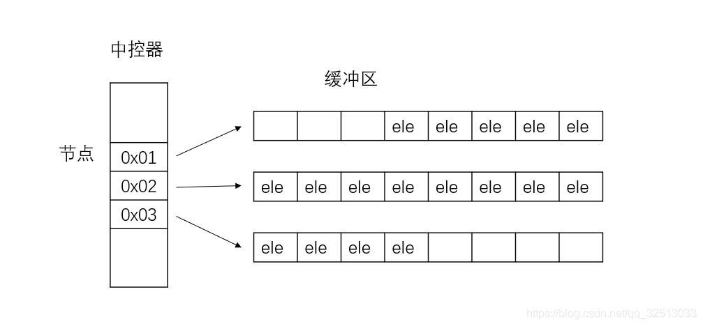
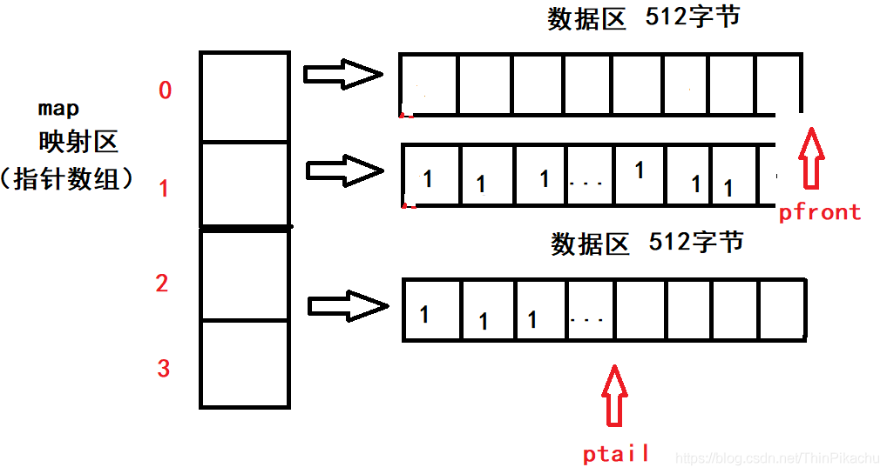

1. deque是一个双端队列容器，其在底层为一个双端队列，所需要的头文件为#include<deque>
2. deque的底层是双端队列，队列内存空间一般是连续的（但其实deque是不连续的，见后续），伪连续使得我们可以使用指针的直接跳转来访问队列中的任何元素，也就是说，我们可以使用 迭代器+偏移 的形式来访问deque容器中的数据。所以我们将deque中的迭代器称为**随机访问迭代器。**

`deque.insert(deque.begin() + 3, 100);_//随机访问迭代器_`

3. 常见函数性能
   1. push_front即头插，在队头一端插入元素，时间复杂度为O(1)。
   2. push_back即尾插，在队尾一端插入元素，时间复杂度为O(1)。
   3. insert 即按迭代器位置插入元素，时间复杂度为O(n)

insert具体是包含：定位O(1) + 数据插入O(1) + 指针数组维护O(n)

4. 底层实现
- deque内部有个中控区，维护每段缓冲区的内容，缓冲区中存放真实数据。
- 中控器维护的是每个缓冲区的地址，使得使用deque时像一段连续的内存空间。
- 当一段缓冲区用完时，在开辟一段新的缓冲区（数组），**每个缓冲区之间的地址并不连续**。

设计deque的人员当初为了标明队列的队头和队尾，引进了两个指针。分别是队头指针 pfront 和队尾指针ptail，并且一开始队头指针和队尾指针都指向队列的中间位置。当我们要在队头插入数据时，队头指针就会向前移动一格。相反的，如果我们要在队尾插入数据时，队尾指针就会向后移动一格。
对于一个buffer连续区域，是从低地址到高地址，也就是0x1 ~ 0x512，如果一个数据结构底层用了deque，每次插入数据地址变大，那说明使用的是尾插ptail右移了，如stack，stack.top()==ptail。
对于queue插入也是ptail右移动，但是queue.front == pfront。

5. 其他

queue、stack实现比deque单纯多了，一个数组就搞定了，但queue和stack底层都直接用的deque进行封装。

