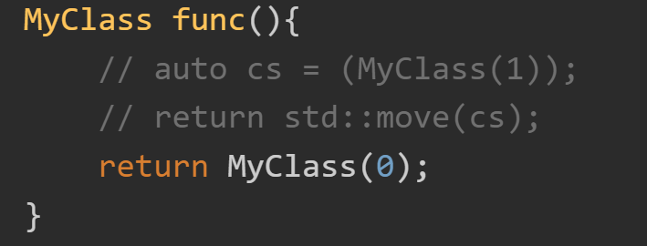
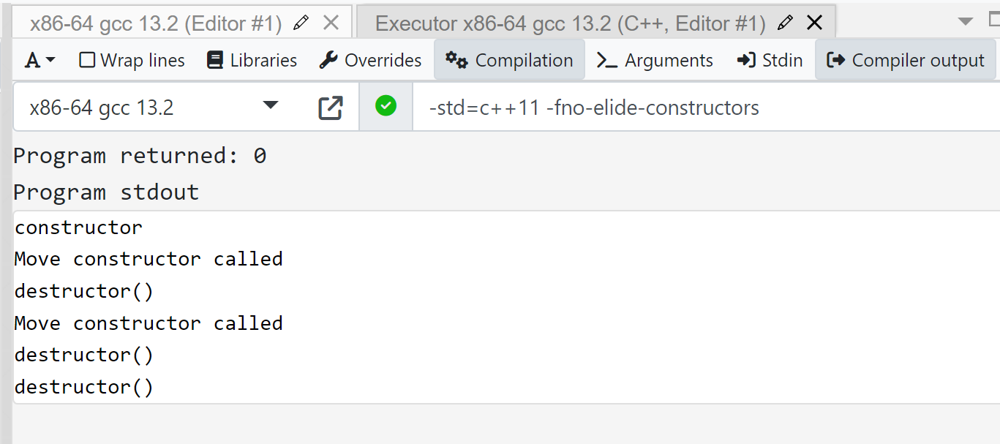

#### 1.数组名和数组指针
```cpp
int main() {
    int arr[5] = {1, 2, 3, 4, 5};
    int (*pArr)[5] = &arr;
    std::cout << arr << std::endl;  // 输出数组第一个元素的地址
    std::cout << &arr[0] << std::endl;  // 输出数组第一个元素的地址
    std::cout << pArr << std::endl;  // 输出整个数组的地址
    std::cout << ((void*)arr==(void*)pArr) << std::endl;  // 1
    std::cout << ((void*)arr==(void*)&arr) << std::endl;  // 1
    std::cout << (arr==&arr[0]) << std::endl;  // 1
}
```
pArr是一个数组指针，pArr类型是'int ()[5]'，arr类型是int*，一旦编译完成本质都是一样的
pArr只是类型不一样而已，但是他们指针值相等，arr本来就是存储数组首个位置了，我用&arr再获取arr的地址那还是 相同的内存位置，此时&arr已经是rvalue了，无法再求&&arr了。
&arr[0]也是int*， 它和arr就是等同使用的，无需类型转换。
}

#### 2.自定义比较函数cmp不能是成员函数
:::success
_如果想要使用成员函数作为比较函数，可以将其声明为静态成员函数或使用 lambda 表达式来调用。这是因为成员函数需要通过对象来调用，而 sort() 只接受函数指针或函数对象。如果将成员函数作为比较函数直接传递给 sort()，会出现成员函数没有指定调用者的问题，从而导致编译错误。_
_没有调用者base指针信息，成员函数就无法正确访问_成员变量和其他成员函数。
:::
给出一个错误示范
```cpp
#include <iostream>
#include <vector>
#include <algorithm>

class MyClass {
public:
    MyClass(int v1, int v2) : m_val1(v1), m_val2(v2) {}

    bool compare1(MyClass& other) {
        return m_val1 > other.m_val1;
    }

    bool compare2(MyClass& other) {
        return m_val2 > other.m_val2;
    }

    void my_sort(std::vector<MyClass>& vec) {
        ::my_sort(vec, compare1);  
        // 错误示范：直接传递成员函数指针会出现成员函数没有指定调用者的问题
    }

private:
    int m_val1, m_val2;
};

void my_sort(std::vector<MyClass>& vec, bool (*func_ptr)(MyClass&, MyClass&)) {
    for (auto i = vec.begin(); i != vec.end(); ++i) {
        for (auto j = i + 1; j != vec.end(); ++j) {
            if (func_ptr(*j, *i)) {
                std::swap(*i, *j);
            }
        }
    }
}

int main() {
    MyClass obj(4, 2);
    std::vector<MyClass> vec = {MyClass(3, 5), MyClass(1, 8), MyClass(2, 4)};
    obj.my_sort(vec);
    for (const auto& item : vec) {
        std::cout << "(" << item.compare1(obj) << ", " << item.compare2(obj) << ") ";
    }
    std::cout << std::endl;

    return 0;
}
```
```cpp
class MyClass {
public:
    MyClass(int v) : m_val(v) {}

    int get_val() const {
        return m_val;
    }

private:
    int m_val;
};

int main() {
    MyClass obj(42);

    int (MyClass::*get_val_ptr)() const = &MyClass::get_val;
    int val = (obj.*get_val_ptr)();

    return 0;
}
```
```cpp
MyClass obj(42);
    mov     DWORD PTR [rbp-4], 42   ; 创建对象 obj，并将其成员变量 m_val 的值设置为 42

    int (MyClass::*get_val_ptr)() const = &MyClass::get_val;
    lea     rax, [rip+get_val_ptr]  ; 将成员函数指针的地址存储到 rax 寄存器中

    int val = (obj.*get_val_ptr)();
    lea     rcx, [rbp-4]            ; 将对象 obj 的地址存储到 rcx 寄存器中，作为调用者的指针
    mov     rax, QWORD PTR [rax]    ; 将成员函数指针的值（即成员函数的地址）存储到 rax 寄存器中
    call    rax                     ; 调用成员函数，并将返回值存储到 eax 寄存器中
```

#### 3.限定域下理解虚函数调用易错例题
```cpp
#include <iostream>
#include <bits/stdc++.h>
using namespace std;

class Base{
    protected:
    int m_data;
    
public:
    Base(int data = 0)
    {    m_data = data;}
    
    int GetData()
    {    return DoGetData();}
    
    virtual int DoGetData(){
        return m_data;
    }

};

class Derive : public Base
{
public:
    Derive(int data = 1)
    {
        m_data = data;
    }
    int DoGetData() override
    {
        return m_data;
    }
protected:
    int m_data;
};

int main()
{
    Derive d;
    std::cout << d.GetData() << std::endl;
    std::cout << d.DoGetData() << std::endl;
    std::cout << d.Base::GetData() << std::endl;
    std::cout << d.Base::DoGetData() << std::endl;
    return 0;
}

```
由于Derive构造过程，会首先执行基类构造函数;由于派生类声明了重名变量和函数，被编译器进行了隐藏操作，此时D内存空间变成了：
:::success
Base::DoGetData(){return Base::m_data;};
Base::m_data;
Base::GetData();
:::
Derive构造完成后变成了
:::success
Base::DoGetData(){return Base::m_data;};
Base::m_data;【注意这个变量是实打实拷贝到d空间里的】
m_data;
void* vptr; //指向Derive类虚表的指针
DoGetData(){return Derive::m_data;};
Base::GetData( call *this.vptr[0] ());【没有被覆盖因此，Derive::GetData();也会导向它】
:::
因此
    std::cout << d.GetData() << std::endl;
    std::cout << d.DoGetData() << std::endl;
前两个为1因为访问到的函数都是在Derive域内的，自然也会访问其内的变量m_data；
  std::cout << d.Base::GetData() << std::endl;
而第三个这个，由于涉及到虚函数调用，因此编译器处理这里是转为了虚表指针去找DoGetData的位置，就是说Base::只会在早绑定中完成基类空间的定位，而调用虚函数DoGetData都是统一从示例空间去找的vptr值（即会从d内存找到函数地址）
    std::cout << d.Base::DoGetData() << std::endl;
这个就会直接访问到Base的函数代码段，里面访问到的变量是Base::m_data
【准确来说】绿色框如果代表d内存区域，那么所有函数都不在里面的，位于text只读执行代码段，只有3个变量会存在于栈内存上；
:::success
vptr;  		// _this$[ebp]
Base::m_data; 	//_this$[ebp+4]
m_data; 		//_this$[ebp+8]
:::
【汇编解读】为什么我看到doGetData()汇编唯一区别：在基类是mov eax, DWORD PTR [eax+4]；而在派生类里是mov eax, DWORD PTR [eax+8]；
这是由于在派生类中，会包含基类的成员。在基类中，**m_data** 是 **int m_data;**，在派生类中也有一个 **int m_data;**。
在基类的实例中，**m_data** 是对象的第一个成员，所以它的偏移量是 0。在派生类中，**m_data** 会被放在基类成员的后面，所以它的偏移量会是基类成员的大小，也就是 4 字节。
因此，在汇编中你看到了不同的偏移量：

   - 在基类中，**m_data** 的地址是 **[eax+4]**，表示相对于对象的起始地址偏移 4 字节处。
   - 在派生类中，**m_data** 的地址是 **[eax+8]**，表示相对于对象的起始地址偏移 8 字节处。

这就是为什么你在汇编中看到了不同的偏移量的原因。这种偏移量的变化是由于派生类中包含了基类的成员所导致的。
【结论】 OOP里面的函数访问的都是唯一标识的自己变量，通常是基类在内存前面，派生类的变量在后面；
如果调用了虚函数，无论怎样都会导向实例内存的虚表所指函数（如果为实例重写了该函数，就一定会访问自己重写的）
#### 4.static函数工程里使用准则
为什么头文件里不要出现static函数？

如果在头文件中声明了static函数，那么所有包含它的源文件都会存在该static函数声明。如果一些源文件要使用该函数，由于static函数仅在当前源文件作用域可见，那么必须在每一个要使用该函数的源文件中都有函数实现，如果仅在一个源文件中实现，其他源文件使用则会编译错误，因为这个实现对于其他源文件是不可见的。

如果在每一个源文件都实现一次相同的函数，则会代码冗余、程序变大，不如定义成普通函数，仅有一处实现、一份执行码。如果在不同源文件有不同的实现，那么头文件中的函数声明就有多个不同实现，含义不明确，会造成歧义，直接放到源文件即可。

所以，在头文件里不要出现static函数的声明。
————————————————
原文链接：[https://blog.csdn.net/fengyuesong/article/details/130315767](https://blog.csdn.net/fengyuesong/article/details/130315767)
demo本地：C:\Users\ding\Desktop\project\dean\static-refer-test

#### 5.union和struct大小计算最佳记忆法
[计算结构体大小（内存对齐原则）struct、union、class_union大小计算-CSDN博客](https://blog.csdn.net/weixin_51547017/article/details/127737623)
#### 6.const 引用接收参数的作用

1. 避免了拷贝构造函数的递归调用（错，这是引用声明的用途，和const无关）
2. 重载规则的不同（常成员函数不讨论）
   1. 顶层const不影响传入函数的对象，不构成函数重载
> void fun(const int a);
> 实际上没有区别，因为函数调用的时候，存在形实结合的过程，所以不管有没有const都不会改变实参的值。

   2. 如果函数的形参是某种类型的指针或引用，通过区分指向的是常量对象还是非常量对象可以实现函数重载。构成函数重载
> 即 1）区分指针与指向常量的指针；2）区分引用与常量的引用 

3. _拷贝构造_的参数是const 类型,所以既可以进行左值引用也可以进行右值引用
> 拷贝构造函数用于创建一个新对象并将原始对象的值复制到新对象中。拷贝构造函数通常通过"const &"表示左值引用。
> 编译器在决定使用移动构造还是拷贝构造时，会根据对象的值类别（左值或右值）来进行选择。如果一个对象是右值，编译器会优先选择移动构造函数；如果一个对象是左值，编译器会选择拷贝构造函数。
> 但是，如果一个对象没有定义移动构造函数，或者对象的资源无法被移动，编译器会选择使用拷贝构造函数进行拷贝操作。

如果func() { A a(1);return std::move(a);}  接收方 auto obj = func()；这时候就会优先匹配移动构造，如果编译器没有默认生成移动构造自己也没有定义，那就转而调用拷贝构造A(const A& s);
我们分析下禁用返回值优化下，调用情况是什么：
> return a;的情况如下
> 1. 调用构造函数，生成对象
> 2. 调用拷贝构造函数，生成临时对象
> 3. 析构第1步生成的对象
> 4. 调用拷贝构造函数，将第2步生成的临时变量拷贝到main()函数中的局部对象obj中
> 5. 调用析构函数，释放第2部生成的临时对象
> 6. 调用析构函数，释放main()函数中的obj局部对象

```cpp
#include <iostream>
#include <cstring>

class MyClass {
private:
char* str;
int n;

public:
// 构造函数
MyClass(int n) {
    std::cout << "constructor "  << std::endl;
}

// 拷贝构造函数
MyClass(const MyClass& other) {
    std::cout << "Copy constructor called" << std::endl;
}

// 移动构造函数
MyClass(MyClass&& other)  {
    str = other.str;
    other.str = nullptr;
    std::cout << "Move constructor called" << std::endl;
}

// 析构函数
~MyClass() {
    std::cout<<"destructor()"<<std::endl;
    //delete str;
}

};
MyClass func(){
    // auto cs = (MyClass(1));
    // return std::move(cs);
    return MyClass(0);
}
int main() {

    MyClass obj = func();
    //MyClass obj2 = obj;
    return 0;
}

```
第一种情况：
[C++17之省略不必要的拷贝Copy Elision_c++ 返回引用 避免拷贝-CSDN博客](https://blog.csdn.net/janeqi1987/article/details/100146445)
[C++为什么纯右值能被延迟析构，将亡值却不行？ - 知乎](https://www.zhihu.com/question/604327959/answer/3093341055)
结果：（开启禁用返回值优化）


1. 

