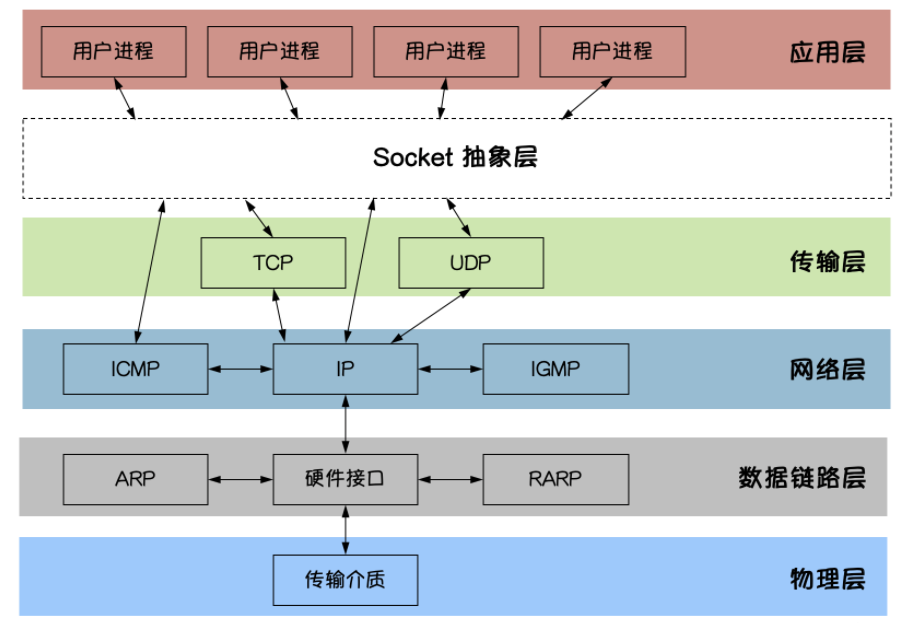
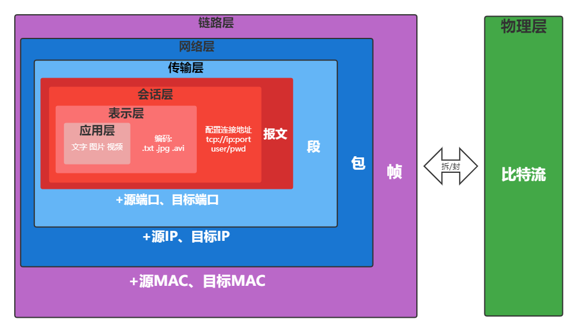
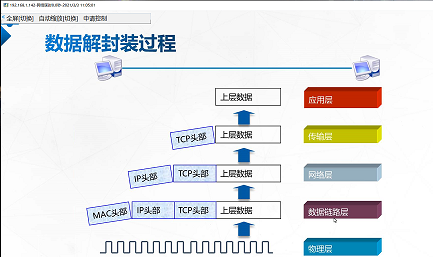
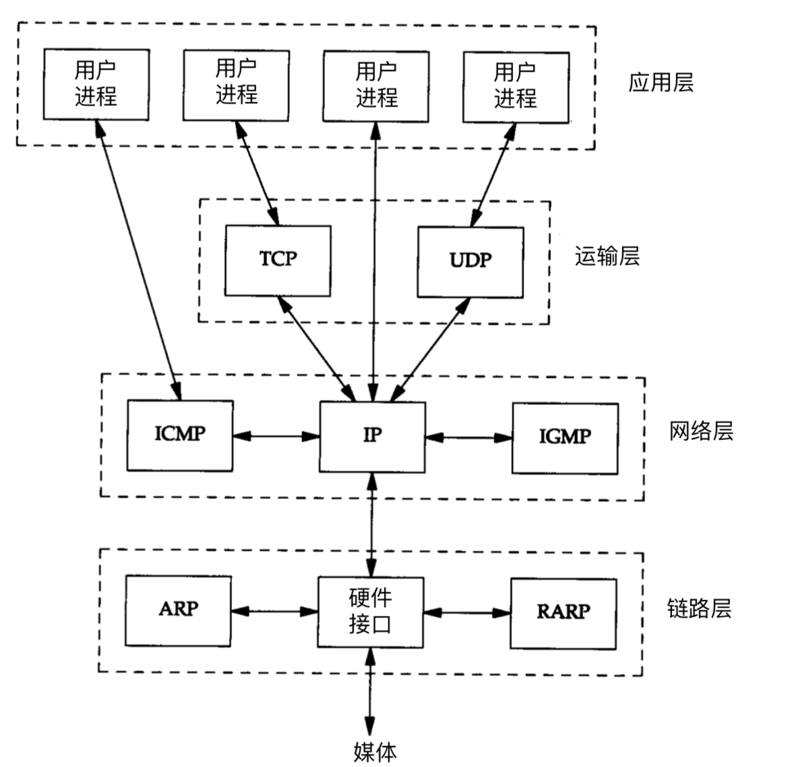

0.ip数据报中的ip怎么来的
是通过OS协议栈

[网络层 IP 首部中的目的 IP 地址是怎么获取的？ - 拾月凄辰 - 博客园](https://www.cnblogs.com/FengZeng666/p/15610870.html)
[TCP Socket 编程原理详解 - 拾月凄辰 - 博客园](https://www.cnblogs.com/FengZeng666/p/15610953.html)
0.报文剥离

1.数据封装与解包逻辑

封装：由于通信数据包需要在往底层流动，以便承载二进制流的物理网线或信号上进行远程沟通，越靠近底层数据越返璞归真，失去语义和抽象文字，回归二进制流，这个过程中需要不断对各层报文加入新的字段以便在数据洪流中正确区分个体或者完整校验等用途。我们从应用层HTTP的文本信息里的特征id（如QQ号）作为不同个体独立标识，到传输、网络层的IP和端口作为标识，到链路层的MAC作为标识、到物理层无标识的0、1数据流
解包：0、1数据流经过帧标识解析给数据链路层，然后由MAC字段解析后发送给网络层、然后借助IP头部(包含souce、destination ip)划分后把数据分发给传输层，传输层通过TCP头部（含端口）的划分传给应用层，各个应用协议解析后返回给请求自身的应用程序中。

