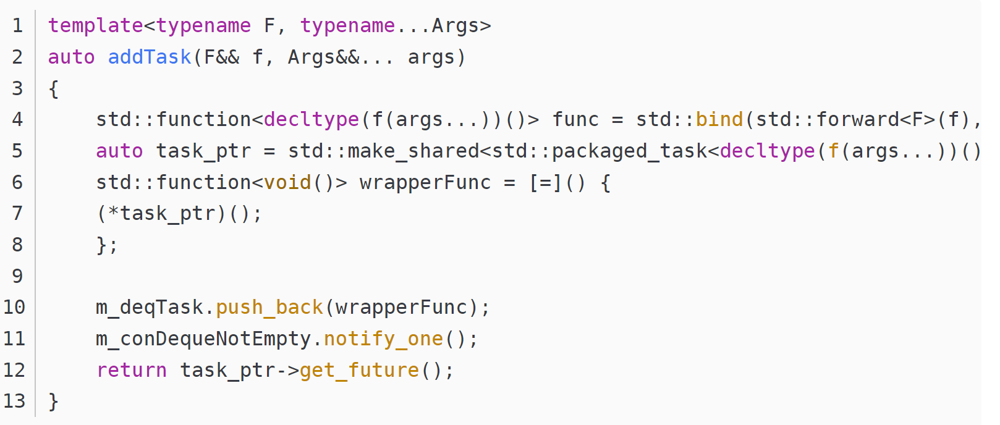
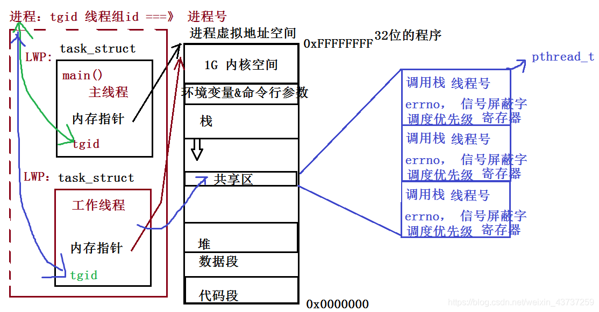
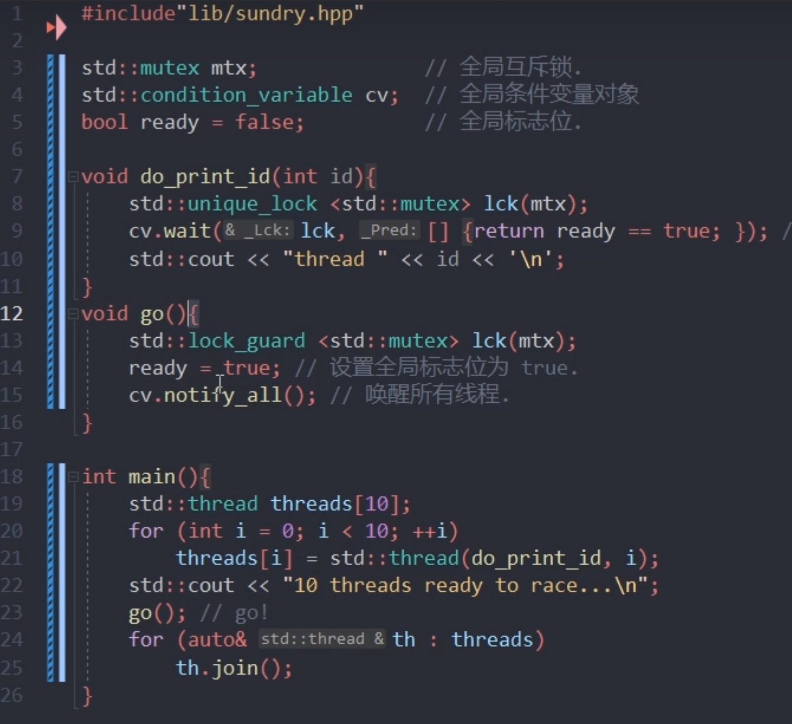

##### x.面试问题
REF：
[轻量级服务器 TinyWebServer --参考和理解下的笔记 - 菜鸟C_5022 - 博客园](https://www.cnblogs.com/wj0518/articles/17176104.html)
[LT模式和ET模式 - DawnHouse - 博客园](https://www.cnblogs.com/dawnHouse/p/16780046.html)
[深入理解 Linux 的 epoll 机制及epoll原理](https://zhuanlan.zhihu.com/p/410316787?utm_id=0)
###### C++14语法封装线程池是用了什么特性
使用了可变长参数模板编程，对其进行改进，使用模板元编程方法，使得线程池可接受任意类型的函数。

其中typename...Args为可变参数，可以接受任意数量的参数，通过bind函数将传入的函数f和对应的参数列表绑定为可执行对象，并通过packged_task封装为智能指针，最后通过匿名表达式包装为function<void()>类型，传入队列之中。如果先要获取执行结果，可以返回get_future，外部通过get获取结果，不然可以不返回值。
如果不使用packged_task再次封装一层，直接使用一下形式代码则会出现执行时对象已经释放的情况，造成崩溃。而function对象又无法封装为智能指针，故需使用packged_task。
###### 你的webserver有什么不同之处
①线程池部分使用了变长模板，同时使用future和packaged_task进行工作线程城池封装，使用了RAII思想用智能指针管理资源自动释放，并发控制使用了mutex和condition_variable，完成临界区互斥访问，以及工作线程的等待和唤醒；
我们使用packaged_task将可调用对象task包装成了一个异步任务。然后，我们将任务提交给工作线程池执行，并使用future获取任务执行结果。最后，我们等待所有任务执行完成。使用future、packaged_task进行工作线程池封装可以让我们更加方便地使用工作线程池；
unique_lock：是mutex提供的类似智能指针的自动维护锁资源释放的工具模板，**std::unique_lock 会在构造时自动上锁**，并在析构时自动解锁。
condition_variable::wait用法：等待cv的notify并阻塞，std::condition_variable::wait 函数需要一个 std::unique_lock 对象作为参数，并且该 std::unique_lock 对象必须与相同的互斥量关联，即m_cv.wait(lk, condition)里的lk，这里会把lk解锁并等待通知；
任务完成后，通过condition_variable::cv.wait(lock);进行休眠，执行前需要确保unique_lock构造进行获取锁权限，确保执行wait时候互斥量处于解锁状态，以便释放mutex占用并休眠；
> Q: 为什么线程池析构时候要cv.notify_all()
> A:  一般是抢夺到mutex权后，设置m_stop退出标志位
> Q:为什么线程池析构函数需要对每一个thread.join();
> A: join()是对目标线程进行阻塞等待，全部阻塞等待意义在于，析构真正释放自我数据空间前，让线程先行退出，避免访问释放的公共资源；
> Q:说说你对m_cv.wait(lk, condition)的理解
> A：使用条件变量时，通常需要与互斥量一起使用。互斥量的作用是保护共享资源，确保在同一时间只有一个线程可以访问共享资源，避免数据竞争和并发访问的问题。在这种情况下，互斥量 m_mutex 可以用于保护条件变量 m_cv 的访问。互斥量 m_mutex 的锁定和解锁操作控制了对条件变量 m_cv 的访问，确保同一时间只有一个线程能够操作条件变量。

②httpd部分

###### 是否测试QPS
使用webbench测试的，blablabla
###### 手写共享、独占指针 （模板类）
```cpp
template<typename T>
class SharedPtr {
public:
    // 构造函数
    SharedPtr(T* ptr) : ptr_(ptr), ref_count_(new int(1)) {}

    // 拷贝构造函数
    SharedPtr(const SharedPtr& other) : ptr_(other.ptr_), ref_count_(other.ref_count_) {
        (*ref_count_)++;
    }

    // 析构函数
    ~SharedPtr() {
        if (--(*ref_count_) == 0) {
            delete ptr_;
            delete ref_count_;
        }
    }

    // 重载赋值运算符
    SharedPtr& operator=(const SharedPtr& other) {
        if (this != &other) {
            if (--(*ref_count_) == 0) {
                delete ptr_;
                delete ref_count_;
            }
            ptr_ = other.ptr_;
            ref_count_ = other.ref_count_;
            (*ref_count_)++;
        }
        return *this;
    }

    // 解引用操作符
    T& operator*() const {
        return *ptr_;
    }

    // 成员访问操作符
    T* operator->() const {
        return ptr_;
    }

private:
    T* ptr_;        // 实际指向的资源
    int* ref_count_; // 记录引用计数的指针
};

```
```cpp
#include <iostream>
using namespace std;

class Type
{
public:
    int a = 1;
};

template<typename T>
class smart_ptr
{
public:
    smart_ptr(T* ptr = NULL) : m_ptr(ptr) {}
    ~smart_ptr() {
        delete m_ptr;
    }
    T& operator*() const { return *m_ptr; }
    T* operator->() const { return m_ptr; }
    operator bool() const { return m_ptr; }

    // 搬移构造
    smart_ptr(smart_ptr&& rhs) noexcept {
        m_ptr = rhs.m_ptr;
        rhs.m_ptr = NULL;
    }
    // 搬移赋值
    smart_ptr& operator=(smart_ptr&& rhs) noexcept {
        m_ptr = rhs.m_ptr;
        rhs.m_ptr = NULL;
        return *this;
    }
private:
    T* m_ptr;
};

int main()
{
    smart_ptr<Type> sptr(new Type);
    smart_ptr<Type> sptr2(std::move(sptr));  // 调用搬移构造
    smart_ptr<Type> sptr3;
    sptr3 = std::move(sptr2);  // 调用搬移赋值
    return 0;
}
```

###### promise、future、packaged_task模板类
先看看task_package的模板类demo源码
###### 在面对cv.wait前lock_guard，为什么直接用mutex.lock(),unlock()。后者什么有什么问题吗？
unique_lock 相比 lock_guard 的好处是：可以随时 unlock() 和 lock()；
异常下的区别：mutex手动释放存在问题，lock_guard避免这个问题，后面详述
_**常见的 4 种错误场景：**_

- Lock/Unlock 不是成对出现
- Copy 已使用的 Mutex（Mutex是值类型，传递的时候是复制）
- 重入 (Mutex不是可重入锁)
- 死锁

死锁一般会在异常时候手动管理类互斥管理模板出现：
**异常**：如果在获取锁后发生异常，你需要在异常处理中记得释放锁，以免造成死锁。
_unique_lock可以直接替换lock_guard，_**_调用unique_lock也不需要手动解锁，只是提供了提前lock和unlock_**_。_
###### 线程池数量怎么设计安排的，无限扩容会有什么问题
###### m_stop部分讲清楚，以及个别garbage线程需要退出如何设计
m_stop和queue.empty()为什么要设计成两次检测；
第一次检测：` m_cv.wait(lk,[this](){ return m_stop||!tasks.empty();});  `
第二次检测：

关键是讲清楚 cv.wait(lock, function)


###### 你提到了promise/future，future是async启动的吗，有哪三种方式（3种策略），和thread的异步区别

1. thread和async启动的异步任务的区别
C++ 中用于启动异步任务的两种不同方式，它们之间有以下主要区别：
1. **返回值类型**：
   - **std::thread**：**std::thread** 会创建一个新的线程来执行指定的函数，并且不会返回任何值。如果需要获取函数的返回值，需要通过其他方式（如引用或指针参数）传递。
   - **std::async**：**std::async** 会返回一个 **std::future** 对象，可以用于异步获取函数的返回值。这允许在需要时等待函数的完成并获取其返回值。
2. **执行方式**：
   - **std::thread**：**std::thread** 会创建一个新的线程来执行指定的函数，该线程会在后台运行并且与调用线程并行执行。
   - **std::async**：**std::async** 可以选择在新线程中执行，也可以在调用线程中执行（默认情况下）。这取决于使用了哪种启动策略。
3. **线程管理**：
   - **std::thread**：需要手动管理线程的生命周期，包括等待线程执行完成、处理线程的异常等。
   - **std::async**：可以通过 **std::future** 来异步获取函数的返回值，无需手动管理线程的生命周期。
4. **返回结果的获取**：
   - **std::thread**：需要手动处理函数的返回结果，通常通过引用或指针参数来实现。
   - **std::async**：可以通过调用 **std::future** 的等待函数（如 **get()**）来获取函数的返回值。
5. **异常处理**：
   - **std::thread**：需要手动处理线程中可能抛出的异常。
   - **std::async**：可以通过 **std::future** 对象来捕获异步任务中抛出的异常。
6. **默认策略**：
   - **std::thread**：总是在新线程中执行。
   - **std::async**：默认情况下，可以由系统决定是在新线程中执行还是在当前线程中执行，这取决于实现和当前的系统负载。
7. **资源回收**：
   - **std::thread**：需要手动调用 **join** 或 **detach** 来释放线程的资源。
   - **std::async**：通常在返回的 **std::future** 对象销毁时自动回收相关资源。
thread\async 使用例子```cpp
#include <iostream>
#include <thread>

void printNumbers() {
    for (int i = 1; i <= 5; ++i) {
        std::cout << i << " ";
    }
    std::cout << std::endl;
}

int main() {
    std::thread t(printNumbers); // 创建一个新线程，并在该线程中执行 printNumbers 函数
    t.join(); // 等待新线程执行完毕

    std::cout << "Main thread continues..." << std::endl;
    return 0;
}

```
```cpp
#include <iostream>
#include <future>

int sum(int a, int b) {
    return a + b;
}

int main() {
    std::future<int> fut = std::async(sum, 3, 4); // 异步执行 sum(3, 4) 函数
    int result = fut.get(); // 获取异步任务的返回值
    std::cout << "Result: " << result << std::endl;
    return 0;
}

```

2. 3种async策略
**std::launch::async**：
   - 意味着创建一个新线程来异步执行任务。
   - **async** 将尽力保证任务会在一个新线程中执行，但具体实现可能会根据系统和资源情况而定。
1. **std::launch::deferred**：
   - 意味着任务将在需要时（例如在调用 **std::future::get()** 或 **std::future::wait()** 时）在调用线程中同步执行，而不会创建新线程。
   - 如果你在一个未等待的 **std::future** 上调用 **get()** 或 **wait()**，则任务会在调用线程中执行。
2. **std::launch::async | std::launch::deferred**：
   - 意味着编译器可以选择在新线程中执行任务，也可以选择在调用线程中同步执行任务，具体取决于实现和运行时的因素。
3. 项目里用到的异步任务模式

**没有用async方式，是通过 std::packaged_task**：
**std::packaged_task** 可以将一个可调用函数包装成一个 **std::future** 对象。你可以将一个函数或者可调用对象传递给 **std::packaged_task** 的构造函数，然后调用 **get_future** 方法来获取与之相关联的 **std::future** 对象。
```
std::packaged_task<int()> task([](){ return 42; });
//传入函数对象
std::future<int> fut = task.get_future();
```
然后你可以在另一个线程中调用 **task()** 来执行包装的可调用对象，从而在异步任务中得到结果。
```cpp
auto taskPtr = std::make_shared<std::packaged_task<decltype(f(args...))()>>(
            std::bind(std::forward<F>(f),std::forward<Args>(args)...)
        );
```
std::make_shared介绍：是 C++ 标准库中的一个模板函数，用于动态分配内存并返回一个指向该内存的 **std::shared_ptr** 对象。
**std::make_shared** 有以下几个优点：
1. **内存分配优化**：**std::make_shared** 会一次性分配内存用于存储对象和控制块（用于跟踪引用计数等信息），这可能会比单独使用 **new** 更高效，因为它减少了额外的内存分配和销毁操作。
2. **避免内存泄漏**：由于一次性分配了内存，即使在构造函数中发生异常，也不会导致内存泄漏，因为内存会在 **std::shared_ptr** 的析构函数中正确释放。
3. **更加简洁和安全**：使用 **std::make_shared** 可以让代码更加简洁，避免手动管理 **new** 和 **delete**，从而降低出错的可能性。

package_task本质还是用的第一种方式创建future对象：
即 std::promise<int>.get_future();
> 传统promise和future关联方式，promise对象引用方式传递给计算函数，作为中间值的set_value(res);
> void calculateValue(std::promise<int>& prom){ 
> int result = 42; 
> prom.set_value(result);
>  }
> std::promise<int> prom; // 创建一个 promise 对象
>  std::future<int> fut = prom.get_future(); // 获取与 promise 相关联的 future 对象
> std::thread t(calculateValue, std::ref(prom));

###### 完整的讲一遍线程池这一块内容
> [基本思路] 管理一个任务队列，一个线程队列，然后每次取一个任务分配给一个线程去做；
> - 在服务器端预先创建一批线程和一个任务队列，每当获取到一个新连接时就将其封装成一个任务对象放到任务队列当中。
> - 线程池中的若干线程就不断从任务队列中获取任务进行处理，如果任务队列当中没有任务则线程进入休眠状态，当有新任务时再唤醒线程进行任务处理。

1.ThreadPool构造函数中完成8个默认线程的创建（m_thread.emplace_back()），并用cv.wait阻塞等待，条件是m_stop || !tasks.empty(), 这里子线程实际上是匿名lambda函数，添加到了m_thread中，内部是while(1)无限循环线程；
:::success
**[this](){访问类成员}** 是一个Lambda表达式（Lambda expression），这里Lambda表达式实际上是一个匿名函数对象，可以像函数一样被调用。使用**[this]**来捕获**this**指针使得Lambda表达式可以在其中访问类的成员。
:::
2.等待epoll_event出现EPOLLIN标志（**EPOLLIN** 表示关联的文件描述符已准备好进行读取。）开始提交任务
 `pool.submit(do_accept, lfd, epfd); `（其中do_accept是处理新客户端函数）
或者执行 `pool.(do_read, pev->data.fd, epfd); `（后续任务变成请求头解析并http_request）
3.然后是任务队列部分，是在ThreadPool里的模板函数`auto submit(F&& f,Args&&... args)`, 完成对成员变量
`_std::queue<std::function<void()>>tasks_`进行emplace(任务之指针)，任务指针用make_shared进行包装了以下函数
`F=std::bind(std::forward<F>(f),std::forward<Args>(args)...)`，至于make_shared的好处嘛见问题8；
由于**std::shared_ptr<xxx> p_task;**为什么需要智能管理见问题11；此时再去
`tasks.emplace(  **[taskPtr](){ (*taskPtr)(); }  **);` 去解引用执行F函数

###### 为什么要用智能指针管理task，并创建了一个taskPtr去调用？避免了什么问题？
使用智能指针 **taskPtr** 来管理 **std::packaged_task** 对象的生命周期有以下好处：
1. **所有权管理：taskPtr** 是一个 **std::shared_ptr**，它会在没有任何指向它的指针时自动释放内存。这确保了在任务执行完毕后，相应的资源会被释放，避免了内存泄漏。
2. **共享任务对象：** 可以将 **taskPtr** 传递给多个地方，让多个线程能够异步获取任务的返回值。
3. **避免悬垂指针问题：** 如果不使用 **shared_ptr** 管理任务对象，那么在任务执行完毕后，如果有其他地方还引用了该任务对象，就会产生悬垂指针问题（dangling pointer），可能导致程序崩溃或不可预测的行为。
4. **std::packaged_task** 对象只支持移动构造

总的来说，使用智能指针可以方便地管理任务对象的生命周期，确保在需要时可以正确地释放相应的资源。
###### move语义的原理
将亡值生命周期这块忘了，看看cpp部分
从实现上讲，std::move基本等同于一个类型转换：static_cast<T&&>(lvalue);
###### 浅拷贝和移动拷贝的区别
浅拷贝=只拷贝变量本身（如果是指针，则存在深拷贝概念，拷贝目标地址数据）
移动拷贝=选取要拷贝变量的地址进行拷贝到自己的变量上；

- 当类没有定义拷贝构造函数的时候，编译器会默认提供一个，这个拷贝函数是**浅拷贝**。**如果该类中含有指针，程序结束后会出现重复释放的问题**
- 为了**解决浅拷贝造成的指针成员重复释放的问题**，可以自定义深**拷贝构造函数**。针对指针[类成员](https://so.csdn.net/so/search?q=%E7%B1%BB%E6%88%90%E5%91%98&spm=1001.2101.3001.7020)，**为新对象分配新的空间，对源对象中指针指向的值进行重新构造**
- 从代码表现上来看和浅拷贝是一样的，只是背后编译器实现不同，把所有权转移了，并没有把数据进行copy，本质上来看是一种定向引用；
###### NRVO和RVO和move使用的原理
因为move只是强转为右值，生命周期并不会改变，需要借助编译器的NRVO类返回值优化，把临时变量在调用方栈上创建才能改变生命周期，从而右值return move();才有意义
# 如果编译器没有实施返回值优化（如RVO或NRVO），并且你尝试移动一个临时类对象的所有权，可能会导致悬空访问（dangling access）问题。# 

###### epoll的I/O多路复用如何理解
多路复用让一个进程同时处理多个IO任务，而不需要为每个任务创建一个独立的线程或进程。
**“多路”**指的是多个IO通道（比如多个sockets），
而**“复用”**指的是通过一种机制，让程序能够有效地处理多个IO通道的状态变化。
###### epoll的哪种模式，程序读取逻辑
epoll默认是level trigger的LT模式，和poll select一样，缓冲区有数据就一直通知；
我用的是Edge trigger模式ET下，同一事件完成的上升沿仅通知一次，需要不断while（1）去read,直到缓冲区为空；
###### epoll的ET模式如何一次读取完数据
基于系统调用错误码errno，如果read返回0 或者 errno==EWOULDBLOCK 
> 系统函数都是成功返回0，失败返回-1，而错误号保存在全局变量errno中，而pthread库的函数都是通过返回值返回错误号

###### epoll的3个接口、参数 ？说一下项目网络编程执行流？
int epoll_create(int size); 
int epoll_ctl(int epfd, int op, int fd, struct epoll_event *event);
int epoll_wait(int epfd, struct epoll_event *events, int maxevents, int timeout);
**执行流：**

1. init_listen_fd(port, epfd) 全局socket(ipv4,tcp) & bind绑定ip端口，为全局epoll树 创建lfd的监听事件
2. do_accept(listen_fd, epfd) 先处理新连接，accept取出建立好的连接套接字cfd，挂在epoll树上，ET对事件的EPOLLIN事件进行监听
3. 从已就绪链表结构中，获得感兴趣事件集合
###### errno是否是线程安全？
POSIX.1c（也称为POSIX.1-1996）引入了对 errno 的线程安全定义，以避免在多线程环境中产生不确定的结果。这个版本的POSIX标准确保了每个线程都有独立的错误号，从而避免了线程之间的错误信息干扰。

[【精选】【Linux】Ⅵ多线程_由于同一进程中的多个线程共享全局数据,因此,在多线程编程中如果一个线程对全局变-CSDN博客](https://blog.csdn.net/weixin_43737259/article/details/115773538)
###### async和packaged_task异步编程区别

###### condition_variable流程用法
> 

1.互斥锁 unique_lock 是针对哪里的？
互斥量加锁为了保证**条件变化**的同步性，条件是可读写变化的，需要用上锁控制单一时间访问，然后再判断condition，如果不通过（false）则释放锁，阻塞休眠，为了其他共享cv的线程做唤醒检测；
如果条件为true（其实是可调用函数返回结果），则wait返回，继续往下执行（阻塞唤醒完成）；
里面关键源码里，是如何阻塞的是关键：
其实是基于信号等待完成休眠和唤醒的，大致逻辑如下：
```cpp
void cv::wait(lk, 条件){
    while(条件不满足){
        lk.unlock();
        wait(signal_coming)
        lk.lock();
    }
    return; //保证结束函数时候lk必须处于锁住状态；
} 
```
**2.为什么会出现虚假唤醒，为什么要用while来避免虚假唤醒？**
[【精选】《C++ 并发编程实战 第二版》：条件变量唤醒丢失与虚假唤醒_条件变量的伪唤醒-CSDN博客](https://blog.csdn.net/qq_39354847/article/details/126432944?spm=1001.2101.3001.6661.1&utm_medium=distribute.pc_relevant_t0.none-task-blog-2%7Edefault%7ECTRLIST%7ERate-1-126432944-blog-125381998.235%5Ev38%5Epc_relevant_sort_base1&depth_1-utm_source=distribute.pc_relevant_t0.none-task-blog-2%7Edefault%7ECTRLIST%7ERate-1-126432944-blog-125381998.235%5Ev38%5Epc_relevant_sort_base1&utm_relevant_index=1)
while(!pred())
            wait(lock);
和 cv.wait(lock, [](){ return pred();});等同
(博客链接里那人写错了注意)
用第二种等效写法简洁，内部模板自动循环完成检查避免spurious awake；
实际上这就是一个虚假唤醒，唤醒后并无工作可做。
_[other]_
_其实除了wait，还有带超时参数的wait_for高级等待；_
_至于为了没有notify_all或者notify_one也能唤醒阻塞线程呢？应该是程序结束时候自动激活的notify_all或者一些spurious notify；_
[【精选】C++并发编程(7)：条件变量（conditional variable）、wait( )与notify_one( )、spurious wakeups(虚假唤醒)_合工大机器人实验室的博客-CSDN博客](https://blog.csdn.net/qq_34935373/article/details/124813627)
###### accept、epoll惊群问题
[Linux惊群效应详解（最详细的了吧）-CSDN博客](https://blog.csdn.net/lyztyycode/article/details/78648798?locationNum=6&fps=1)
###### SO_REUSEADDR和SO_REUSEPORT参数区别
[网络编程中的SO_REUSEADDR和SO_REUSEPORT参数详解_Milu_Jingyu的博客-CSDN博客](https://blog.csdn.net/Milu_Jingyu/article/details/129161024)
前者是4次挥手后的TIME_WAIT阶段能够端口复用；
后者用途：
目的：**每一个进程有一个独立的监听socket，并且bind相同的ip:port，独立的listen()和accept()；提高接收连接的能力。（例如nginx多进程同时监听同一个ip:port），**并且在内核层面实现自动负载均衡
###### 如果用水平触发还不想反复通知怎么办？如果用边沿触发缓冲区大小不够不能一次读完怎么办？
LT不想反复通知就
参考：
[epoll在LT和ET模式下的读写方式](https://www.yuque.com/xujunze/backend/qpan0b?view=doc_embed)

-  在epoll的ET模式下, 正确的读写方式为:

读: 只要可读, 就一直读, 直到返回0, 或者 errno = EAGAIN
写: 只要可写, 就一直写, 直到数据发送完, 或者 errno = EAGAIN

- 对于non-blocking的socket,  正确的读写操作为:

读: 忽略掉errno = EAGAIN的错误, 下次继续读 
写: 忽略掉errno = EAGAIN的错误, 下次继续写 
对于select和epoll的LT模式, 这种读写方式是没有问题的。
> (注: EAGAIN就是EWOULDBLOCK)
> 从字面上看, 意思是:
> * EAGAIN: 再试一次
> * EWOULDBLOCK: 如果这是一个阻塞socket, 操作将被block
> * perror输出:  Resource temporarily unavailable

