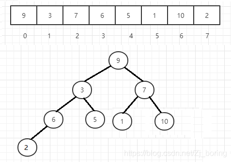

### 1.构建小根堆
```cpp
vector<int> arr;

void buildMinHeap(int firstIndex, int endIndex) {
    for (int i = endIndex/2; i >= firstIndex; i--) {
        adjustDown(i, endIndex);
    }
}

void adjustDown(int parentIndex, int endIndex) {
    int left = 2 * parentIndex + 1;
    int right = 2 * parentIndex + 2;
    //最小值的下标
    int minIndex = parentIndex;
    if (left < endIndex && arr[left] < arr[minIndex]) {
        minIndex = left;
    }
    if (right < endIndex && arr[right] < arr[minIndex]) {
        minIndex = right;
    }
    if (minIndex == parentIndex) {
        return;
    }
    //交换元素
    swap(parentIndex, minIndex);
    //递归调整
    adjustDown(minIndex, endIndex);
}
```
arr看做完全二叉树，直接下标关系 

- _ leftNodeIndex = ParentNodeIndex*2 +1 _
- _rightNodeIndex = ParentNodeIndex*2 +2_
- _ParentNodeIndexl = childNodeIndex/2 _

从最后一个元素开始往上调整，即adjustDown(待调整子树根节点Index，末尾下标)

- 末尾下标：用于下表关系计算时判断是否越界
- 待调整子树根节点Index：如图，从6为根子树开始往前才是有子节点的
- 递归调整：从3为根的位置开始，交换swap，会导致子树不再是小根堆，立即向下递归纠正


### 2.Heap Sort
建立完小根堆后，最小元素再第一位（唯一性质），我们和末尾元素交换，并把末尾下标减一；
代表最后一个元素已经排序好了，然后重复调用adjustment(0, end-1)；重复以上；
最终，得到的vector是一个从大到小的排序序列；
注：由于该调整策略 ，堆排序不稳定（易举例）
```cpp
void heapSort() {
    int n = arr.size();
    //1. 将数组构建成小根堆
    buildMinHeap(0, n);
    //2. 将堆顶元素（最小值）与堆底元素交换，并将堆的大小减1
    for (int i = n - 1; i > 0; i--) {
        swap(0, i);
        //3. 对剩下的元素重新进行堆化
        adjustDown(0, i);
    }
}
```
### 3.LeetCode相关练手题
C++ 【时间:击败95%】【空间：击败100%】【特色：原地空间O(1)解法】 [https://leetcode.cn/problems/total-cost-to-hire-k-workers/solutions/2348255/tiao-zhan-o1kong-jian-fu-za-du-shuang-du-u2m3/?envType=study-plan-v2&envId=leetcode-75](https://leetcode.cn/problems/total-cost-to-hire-k-workers/solutions/2348255/tiao-zhan-o1kong-jian-fu-za-du-shuang-du-u2m3/?envType=study-plan-v2&envId=leetcode-75)
