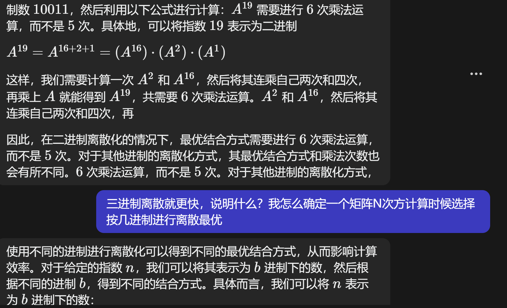
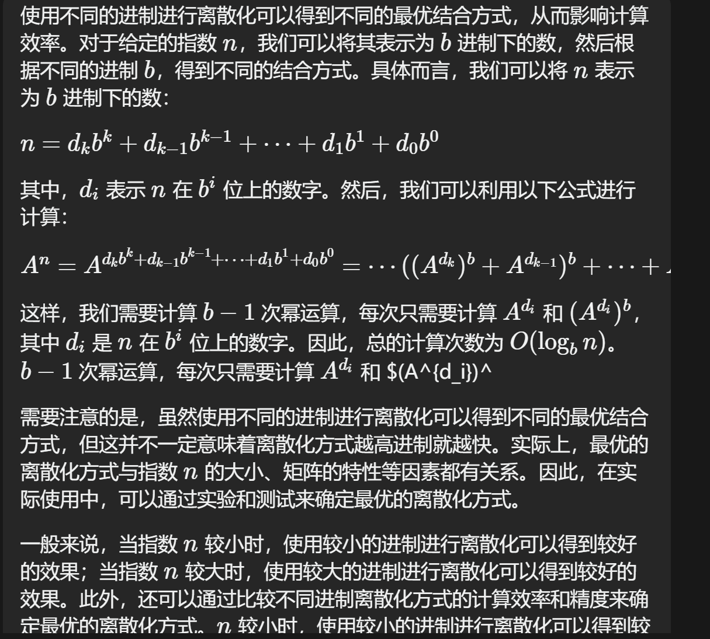

[https://www.cnblogs.com/yan-boy/archive/2012/11/29/2795294.html](https://www.cnblogs.com/yan-boy/archive/2012/11/29/2795294.html)
```cpp
while(n>0)
{
    if(n&1) res*=A;
    A=A*A;
    n>>=1;
}
```
A_A_A_A_A_A => (A_A)_(A_A)_(A_A)
这样变的好处是，你只需要计算一次A_A，然后将结果(A_A)连乘自己两次就能得到A^6，即(A_A)^3=A^6。算一下发现这次一共乘了3次，少于原来的5次。如果用二进制去离散：例如A^19 => （A^16）_（A^2）_（A^1）一共有6次乘法，那为什么不用3进制了 A^19=A^9 * A^9_ A 一共才5次啊



