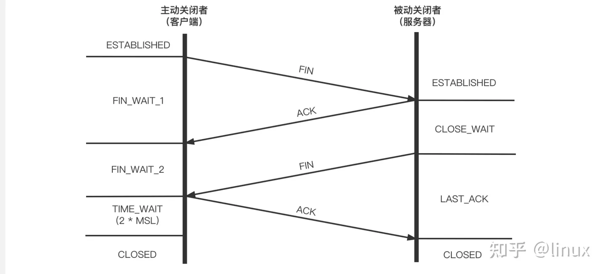
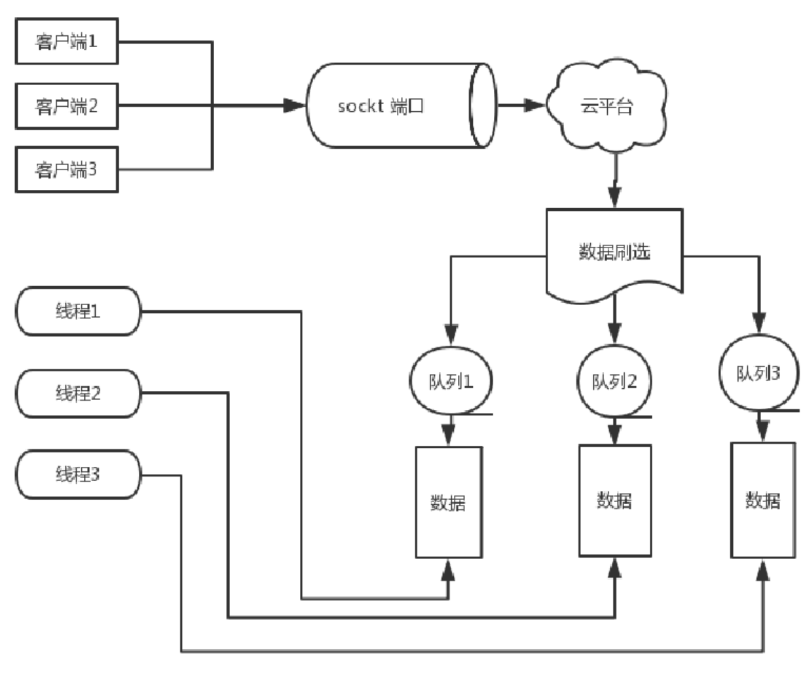

### 
### TCP三次握手过程：

   - 第一次握手：客户端发送一个带有 SYN 标志的数据包给服务器，表明客户端请求建立连接，并设定客户端的初始序列号。
   - 第二次握手：服务器收到客户端的 SYN 数据包后，会发送一个带有 SYN/ACK 标志的数据包给客户端，表示同意建立连接，同时设定服务器的初始序列号。
   - 第三次握手：客户端收到服务器的 SYN/ACK 数据包后，再发送一个带有 ACK 标志的数据包给服务器，表示确认建立连接。服务器收到这个 ACK 数据包后，连接建立完成，可以开始数据传输。
### TCP四次挥手过程：

   - 第一次挥手：客户端发送一个带有 FIN 标志的数据包给服务器，表示要关闭连接。
   - 第二次挥手：服务器收到客户端的 FIN 数据包后，发送一个带有 ACK 标志的数据包给客户端，表示收到了关闭请求，但还没有准备好关闭连接。
   - 第三次挥手：服务器完成对数据的处理后，发送一个带有 FIN 标志的数据包给客户端，表示服务器准备好关闭连接。
   - 第四次挥手：客户端收到服务器的 FIN 数据包后，发送一个带有 ACK 标志的数据包给服务器，表示确认收到关闭请求。服务器收到这个 ACK 数据包后，连接关闭。
### 建立连接需要三次握手，而断开连接需要四次挥手的原因：

   - 建立连接时，三次握手是为了确保双方的通信能力和可达性，以避免由于网络问题或服务器资源限制等原因造成无效连接的建立。
   - 断开连接时，四次挥手是因为 TCP 是全双工通信协议，双方都可以同时发送和接收数据。在关闭连接时，双方需要分别通知对方自己不再发送数据，然后等待对方确认，确保数据的完整传输。
### TIME_WAIT状态持续时间及引入原因：

   - TIME_WAIT 状态是在 TCP 连接关闭后，等待一段时间的状态。持续时间通常是 2MSL（Maximum Segment Lifetime，最大报文段生存时间）。MSL 是一个估算的时间值，表示一个数据包在网络中能够存活的最长时间。2MSL 的目的是确保在网络中的所有延迟、重传等导致的滞留数据都能被清除，以防止在新的连接中出现旧的数据包。
   - TIME_WAIT 状态的原因是为了处理网络中可能滞留的数据，防止出现旧连接的数据包干扰新连接的建立和通信。
   - 为什么需要time_wait状态？
TIME_WAIT(2MSL)1. **确保最后一个确认报文段能够到达。**如果 B 没收到 A 发送来的确认报文段，那么就会重新发送连接释放请求报文段，A 等待一段时间就是为了处理这种情况的发生。

2.** 可能存在“已失效的连接请求报文段(旧的连接序列号对不上)”**，为了防止这种报文段出现在本次连接之外，需要等待一段时间。防止串话。

（因为在Linux上一个TCP端口不能被同时打开多次，当一个TCP连接处于TIME_WAIT状态时，我们无法立即使用该连接端口来建立新的连接，这样就防止了串话）
### UDP并发如何实现？

   - 对于TCP 服务器来说，有一个新的客户端连接的时候，会产生一个新的[socket](https://so.csdn.net/so/search?q=socket&spm=1001.2101.3001.7020)用于和新客户端通信。而对于UDP来说，服务器只有一个socket。所有的客户端都是通过同一个socket进行通信。
   - 方式一：随机端口，tftpd 程序采用的是随机端口的方式。也就是说如果有一个新的客户端过来，服务器会再随机绑定一个端口号，生成一个新的socket和客户端通信。缺点：数量有限，占用端口。
   - 方式二：数据队列方式，引入三类线程分别处理listen、recv、handle；分别是监听新客户端插入新的队列；recv对已连接客户端新数据进行入队；handle，由listen后创建的线程，专一处理某客户端数据。

### TCP首部长度，有哪些字段：

   - TCP 首部长度可变，最小长度为 20 字节，最大长度为 60 字节。其中常见的字段有：
      - 源端口号和目标端口号：用于标识通信的应用程序。
      - 序列号和确认号：用于可靠传输和确认数据的传输情况。
      - 数据偏移：指示 TCP 首部的长度，以 4 字节为单位。
      - 标志位：包括 SYN、ACK、FIN、RST 等，用于控制连接的建立和关闭。
      - 窗口大小：用于流量控制。
      - 校验和：用于检测首部和数据的错误。
      - 紧急指针：用于指示紧急数据的位置。
### TCP在listen时的参数backlog的意义：

   - 在 TCP 服务器端调用 **listen** 函数时，**backlog** 参数指定了服务器等待连接队列的最大长度。当有新的客户端连接请求到达服务器端，服务器会将其放入等待连接队列，然后逐个处理队列中的连接请求。
   - 如果队列已满（即等待连接的数量达到了 **backlog** 的上限），新的连接请求将被服务器拒绝或忽略，直到队列中有连接被处理并释放出空间。
   - 因此，**backlog** 参数可以影响服务器的并发能力和连接处理效率。合理设置 **backlog** 可以根据服务器的负载和处理能力来平衡连接的处理。
### Accept发生在三次握手的哪一步？三次握手完成后

   - **accept** 是在服务器端等待并接受客户端连接的函数。它实际上是在服务器的被动打开套接字上调用，该套接字通过 **listen** 函数预先设置好了队列，用于存放等待连接的客户端。
   - 当客户端发起连接请求并完成三次握手后，服务器端的 **accept** 函数会从等待连接队列中取出一个连接请求，并创建一个新的套接字用于与客户端通信，然后返回这个新的套接字的文件描述符。
### 三次握手过程中有哪些不安全性
> 在TCP的三次握手过程中，存在一些潜在的不安全性，尽管这些情况在实际网络环境中较为罕见，但仍值得考虑：
> 1. SYN 攻击（SYN Flood）：恶意的攻击者可能发送大量的伪造SYN包给服务器，导致服务器不断响应并建立半连接状态（SYN_RCVD），从而消耗服务器资源，使其无法处理正常的连接请求。
> 2. 连接劫持（Connection Hijacking）：在三次握手过程中，如果攻击者能够截获并修改客户端的SYN包，将其发送给另一个目标，就可以在客户端和伪造目标之间建立连接，绕过正常的三次握手过程。
> 3. SYN-ACK 攻击：在第二次握手时，攻击者可能伪造服务器的SYN-ACK响应，发送给客户端，导致客户端误以为连接已建立。这样，客户端会发送ACK确认包，但实际上连接并没有建立。
> 4. **Land 攻击** , 当一个主机向服务器发送SYN请求连接，服务器回复ACK和SYN后，攻击者截获ACK和SYN。然后伪装成原始主机继续与服务器进行通信 , 目标地址和源地址都是目标本身,自己联系自己
> 
为了应对这些潜在的不安全性，TCP协议和实现通常会采取一些防护措施，例如使用 SYN Cookie 技术来防范 SYN 攻击、使用随机化的初始序列号（ISN）来增加连接的安全性、使用加密技术防范连接劫持等。此外，防火墙和入侵检测系统也可以用于监测和抵御一些恶意的连接请求。尽管存在潜在的不安全性，TCP的三次握手过程在实际应用中仍然被广泛使用，并且被认为是可靠的连接建立方式。

### TCP与UDP的区别
TCP（传输控制协议）和UDP（用户数据报协议）是两种常用的传输层协议，用于在计算机网络中传输数据。它们之间有以下主要区别：

1. 连接与非连接：
   - TCP是面向连接的协议。在数据传输之前，必须先建立连接，通过三次握手确认连接的建立，然后才能进行数据传输，确保数据的可靠性。
   - UDP是面向无连接的协议。在数据传输之前不需要建立连接，直接将数据发送出去，没有确认机制，不保证数据的可靠性。
2. 可靠性：
   - TCP提供可靠的数据传输。它通过确认、重传和流量控制等机制确保数据的可靠传输，数据不会丢失、重复或失序。
   - UDP提供不可靠的数据传输。它没有确认和重传机制，一旦数据发送出去就不再关心，数据可能会丢失或失序，也不会有重传。
3. 传输效率：
   - TCP的传输效率较低。由于建立连接和数据确认等机制，TCP的开销较大，适用于对数据可靠性要求较高的应用场景。
   - UDP的传输效率较高。由于没有连接建立和确认机制，UDP的开销较小，适用于对实时性要求较高的应用场景。
4. 顺序性：
   - TCP保证数据的顺序性。TCP会按照数据的顺序进行发送和接收，确保数据按照发送的顺序进行传输。
   - UDP不保证数据的顺序性。UDP发送的数据包之间没有固定的顺序，可能会出现乱序的情况。
5. 流量控制：
   - TCP提供流量控制机制。它通过滑动窗口算法来控制发送方的发送速率，避免发送过快导致接收方缓冲区溢出。
   - UDP没有流量控制机制。发送方会以最大速率发送数据，无法控制接收方的处理能力。
6. 适用场景：
   - TCP适用于对数据可靠性要求高的场景，如文件传输、电子邮件等。
   - UDP适用于对实时性要求高、允许数据丢失的场景，如实时视频、语音通话等。
